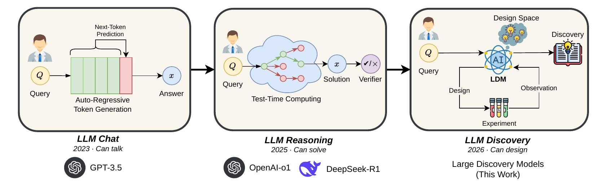
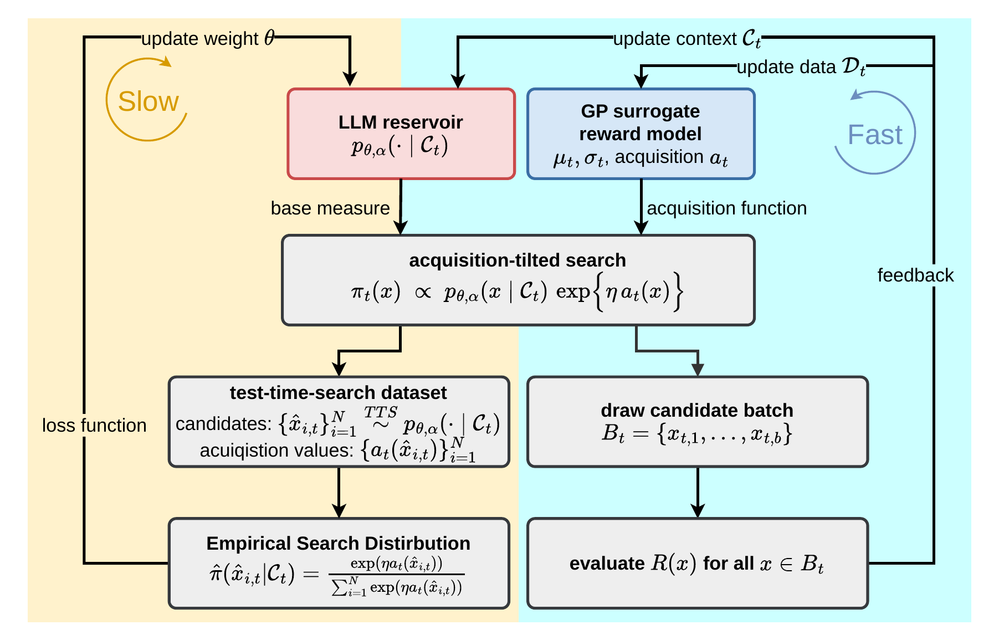
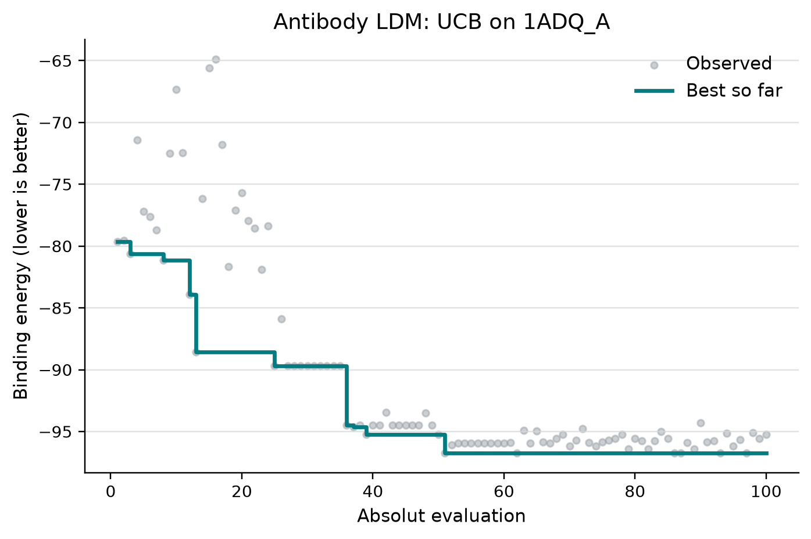
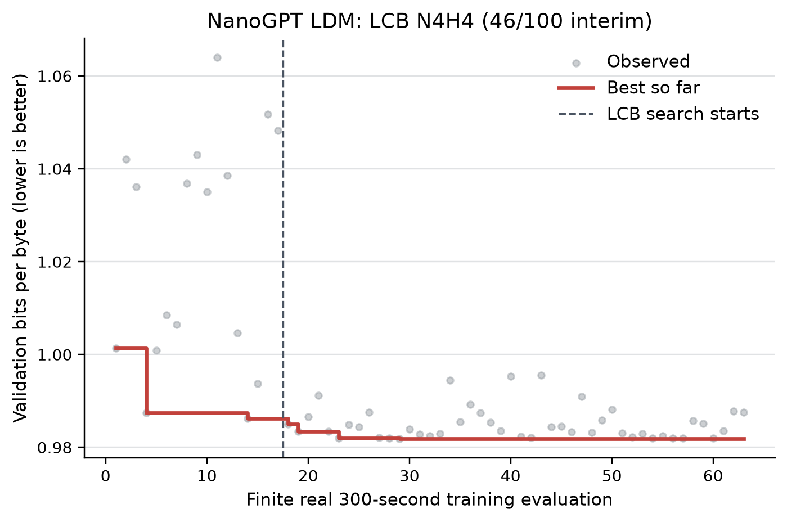
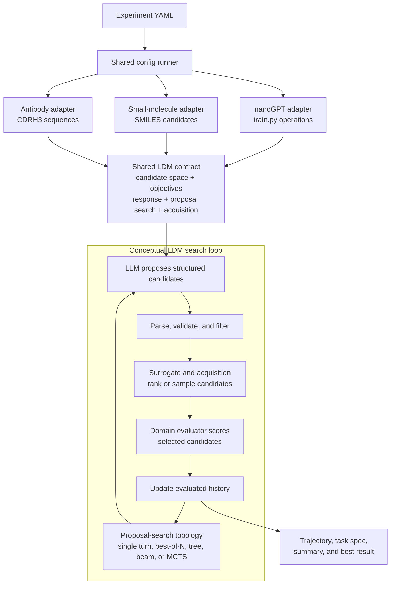

<h1 align="center">LDM-TTS: Large Discovery Model Test-Time Search</h1>

<p align="center">
  
  
  
  
</p>

<p align="center">
  <a href="assets/evolution.drawio.pdf">
    
  </a>
</p>

<p align="center"><em>From producing an answer, to reasoning about an answer,
to managing an open-ended discovery process. Click the figure to open the
original PDF.</em></p>

**LDM is not primarily a model that tries once to generate an accurate
answer. It is a model that understands and steers the research process that
produces better answers over time.**

An LLM supplies structured candidate generation; a probabilistic surrogate
turns external observations into predictions and epistemic uncertainty; and
an acquisition function turns that search state into the next decision. The
result is a recurrent `generate -> select -> evaluate -> update` loop grounded
in evidence rather than model confidence alone.

## Repository Scope

| Task | Optimizes | Start Here | Reference |
| --- | --- | --- | --- |
| `nanogpt` | Training-code and hyperparameter operations for nanoGPT-style pretraining. | [Clean-room quick start](tasks/nanogpt/QUICKSTART.md) | [Task guide](tasks/nanogpt/README.md) |
| `small_molecule` | SMILES candidates for docking and activity objectives. | [Clean-room quick start](tasks/small_molecule/QUICKSTART.md) | [Task guide](tasks/small_molecule/README.md) |
| `antibody` | CDRH3 amino-acid sequences for antigen binding. | [Clean-room quick start](tasks/antibody/QUICKSTART.md) | [Task guide](tasks/antibody/README.md) |

All three clean-room guides begin with deterministic mock or CPU-safe gates and
progress through locked installation, dependency preflight, artifact checks,
and credential cleanup before any costly run. The evaluator-backed campaign
examples below additionally cover real GPU nanoGPT training, Vina plus G12D
scoring, and Absolut evaluation. Run the documented commands from the
repository root.

Task authors can add a manifest-registered adapter without editing the shared
runner. See [Registering LDM Tasks](tasks/README.md) or use the repository-local
agent workflows cataloged under [`skills/`](skills/README.md):

- `register-ldm-task` scaffolds and implements a new task.
- `run-ldm-task` validates and progressively executes an existing task.

## The Research Loop

Within each discovery round, the LLM supplies a candidate reservoir while a GP
surrogate and acquisition function tilt search toward promising candidates.
Evaluation feedback updates the surrogate and model context in the fast loop;
the accumulated test-time-search data can also support slower model updates.

[](assets/loop.drawio.pdf)

*The LDM optimization loop. Click the figure to open the original PDF.*

## Real Campaign Examples

The repository includes three compact plots from evaluator-backed campaigns in
[`assets/examples/real_100_20260809/`](assets/examples/real_100_20260809/README.md).
They establish that all three adapters run end to end and that their observed
incumbents improve under the configured LDM loops.

| Antibody: UCB, 100 evaluations | Small molecule: EHVI, 100 evaluations | nanoGPT: LCB, interim at 46/100 |
| --- | --- | --- |
|  |  |  |

| Task | Real evidence | Observed result |
| --- | --- | --- |
| Antibody | 100 Absolut evaluations on `1ADQ_A`; 20 initialization evaluations followed by 80 UCB selections. | Best binding energy improved from -88.56 after initialization to -96.72. |
| Small molecule | 100 Vina plus G12D activity evaluations with EHVI selection. | Pareto hypervolume reached 22.8080517046179. |
| nanoGPT | 20 warm-up attempts and an interim snapshot after 46 real LCB-selected training evaluations. | Best finite `val_bpb` improved from 0.986220 in warm-up to 0.981905. |

The nanoGPT campaign was still running when its example was frozen, so the
figure is deliberately labeled interim. More importantly, improving curves are
evidence of optimization progress, not a controlled causal estimate of the LDM
component. Establishing an LDM advantage requires multiple seeds and matched
random, pure-LLM, BO-only, and acquisition-ablation baselines.

Use [`AGENT_README.md`](AGENT_README.md) for the machine-oriented execution,
validation, resume, plotting, and safety checklist. Use
[`scripts/plot_campaigns.py`](scripts/plot_campaigns.py) to regenerate the
three trajectory views from persisted artifacts.

## Quick Start

Start from the repository root:

```bash
cd /path/to/LDM_merge
```

Install the task environments you plan to use:

```bash
uv sync --locked --project tasks/nanogpt
uv sync --locked --project tasks/small_molecule
uv sync --locked --project tasks/antibody
```

List configs and preview the mock suite:

```bash
python scripts/run_ldm_tts.py --list
python scripts/run_ldm_tts.py config/suites/mock_all.yaml --dry-run
```

Run fast mock experiments:

```bash
uv run --locked --project tasks/nanogpt \
  python scripts/run_ldm_tts.py config/nanogpt/mock_best_of_n.yaml
CUDA_VISIBLE_DEVICES='' uv run --locked --project tasks/small_molecule \
  python scripts/run_ldm_tts.py config/small_molecule/mock_m1_stratified_oversample.yaml
CUDA_VISIBLE_DEVICES='' uv run --locked --project tasks/antibody \
  python scripts/run_ldm_tts.py config/antibody/mock_ei.yaml
```

Mock configs are the safest first check. They exercise the merged runner,
task-space specs, response parsing, and trajectory plumbing without requiring
real LLM endpoints or domain-specific external tools.

## Environment Setup

Real experiments need an OpenAI-compatible LLM endpoint. CUDA requirements are
task-specific; the validated small-molecule direct and antibody smoke paths are
CPU-only:

```bash
export CUDA_VISIBLE_DEVICES=''
export LLM_BASE_URL=https://your-model-host.example/v1
export LLM_API_KEY=your-api-key
export LLM_MODEL_NAME=your-served-model
```

nanoGPT also accepts its historical LLM variable names:

```bash
export TTS_LLM_URL=$LLM_BASE_URL
export TTS_LLM_API_KEY=$LLM_API_KEY
export TTS_LLM_MODEL=$LLM_MODEL_NAME
```

### OpenAI-Compatible Served Model API

Real runs (`mock: false`) require a reachable served chat model or model API;
mock smoke runs do not contact an LLM endpoint.

All three task adapters support an OpenAI-compatible Chat Completions API,
including models served locally by vLLM, SGLang, or another compatible server,
and authenticated remote gateways such as LiteLLM. `LLM_BASE_URL` must be the
API root, normally ending in `/v1`; do not include `/chat/completions`, because
the OpenAI client appends that route. `LLM_MODEL_NAME` must match a model ID
advertised by the server.

Use `EMPTY` when a local server requires the Authorization header but does not
validate credentials. Use the actual secret for remote or authenticated APIs.
Do not commit real keys to YAML or `.env` files.

Provider settings should remain environment-only. Set optional provider fields
to `null` in committed configs so the task adapter reads the environment and
secrets do not enter process arguments or dry-run output:

```yaml
args:
  llm-url: null
  api-key: null
  llm-model-name: null
```

Verify model discovery and Chat Completions before launching a real search.
Use the environment-only Python probe in the relevant
[nanoGPT](tasks/nanogpt/QUICKSTART.md#8-optional-real-run-preparation),
[small-molecule](tasks/small_molecule/QUICKSTART.md#6-probe-the-model-api), or
[antibody](tasks/antibody/QUICKSTART.md#5-probe-the-model-api) quick start.
The dependency checker validates that URL, model, and key settings are present;
the probe additionally verifies the routes used at runtime.

Small-molecule real runs need additional task dependency paths:

```bash
export VINA_BIN=/path/to/vina
export G12D=tasks/small_molecule/resources/models/best_g12d_model.joblib
export REASYN_REPO=/path/to/ReaSyn
export REASYN_PYTHON=/path/to/ReaSyn/.venv/bin/python
```

Antibody real runs require an external Absolut installation. Prefer
`ABSOLUT_PATH=/path/to/Absolut` or `--absolut-path` instead of editing the
committed task config.

Non-secret dependency paths can also be set under config `env:` or passed as
explicit task CLI arguments. Keep API keys in the process environment.

## Dependency Checks

Before running task-relevant real experiments, run the dependency checker on
the exact config you plan to use:

```bash
uv run --locked --project tasks/nanogpt \
  python scripts/check_task_dependencies.py config/nanogpt/real_operation_tool_best_of_n.yaml
CUDA_VISIBLE_DEVICES='' uv run --locked --project tasks/small_molecule \
  python scripts/check_task_dependencies.py \
  config/small_molecule/real_m1_seed_analog.yaml --no-optional
CUDA_VISIBLE_DEVICES='' uv run --locked --project tasks/antibody \
  python scripts/check_task_dependencies.py config/antibody/real_cpu_smoke.yaml
```

The checker reads the same YAML configs as the runner and reports `OK`,
`WARN`, `FAIL`, or `SKIP` for each dependency. It checks lightweight things
only: configured LLM settings, CUDA visibility, file paths, Vina executability,
ReaSyn checkout/imports/checkpoints, nanoGPT data artifacts, antigen inputs, and
the Absolut executable. The complete clean installation workflows are in the
[nanoGPT](tasks/nanogpt/QUICKSTART.md),
[small-molecule](tasks/small_molecule/QUICKSTART.md), and
[antibody](tasks/antibody/QUICKSTART.md) quick starts.

If a config mentions optional dependencies that the selected method will not
use, such as ReaSyn paths in a direct-only small-molecule run, add
`--no-optional`. For nanoGPT, this also skips `prepare.py` data and tokenizer
checks only when the resolved plan sets `args.skip-eval: true`. Evaluated runs
continue to treat missing training data as a blocking failure.

Use the staged first-real-run guide for the task you are deploying:

- [nanoGPT clean-room quick start](tasks/nanogpt/QUICKSTART.md)
- [Small-molecule clean-room quick start](tasks/small_molecule/QUICKSTART.md)
- [Antibody clean-room quick start](tasks/antibody/QUICKSTART.md)

Use overrides exactly as with the runner:

```bash
uv run --locked --project tasks/small_molecule \
  python scripts/check_task_dependencies.py \
  config/small_molecule/real_m1_seed_analog.yaml \
  --set args.vina-bin=/path/to/vina
```

The small-molecule real workflow also performs an early runtime preflight for
Vina and the activity model before starting a search.

## Config-Driven Runs

Experiments are YAML files under `config/`. A config selects the task,
algorithm label, mode, environment variables, and task CLI arguments.

Minimal shape:

```yaml
name: small_molecule_mock_m1
task: small_molecule
algorithm: m1_stratified_direct_llm_oversample_sir
mode: mock
env:
  G12D: tasks/small_molecule/resources/models/best_g12d_model.joblib
args:
  mock: true
  budget: 8
  batch-size: 1
  nn-model-path: ${G12D}
```

Important fields:

| Field | Meaning |
| --- | --- |
| `name` | Human-readable run name. |
| `task` | One of `nanogpt`, `small_molecule`, or `antibody`. |
| `algorithm` | Bookkeeping label for the run style. |
| `mode` | Usually `mock` or `real`. |
| `env` | Environment variables set for the run. |
| `args` | CLI options passed to the task workflow, without the leading `--`. |
| `runner` | Optional task module or working-directory override. |

Useful commands:

```bash
python scripts/run_ldm_tts.py config/small_molecule/mock_m1_stratified_oversample.yaml --dry-run
python scripts/run_ldm_tts.py config/suites/mock_all.yaml
```

Override config values with dotted paths:

```bash
python scripts/run_ldm_tts.py config/nanogpt/mock_best_of_n.yaml \
  --set args.iterations=5 \
  --set args.run-name=nanogpt_mock_iter5
```

Config values support:

- `null` to omit an optional CLI argument and let the task default apply
- runner placeholders such as `{repo_root}` and `{task_dir}`
- environment references in `args`, such as `vina-bin: ${VINA_BIN}`
- repository-root expansion for values starting with `tasks/`, `config/`,
  `data/`, `ldm_tts/`, or `scripts/`

Suite configs contain an `experiments` list and run the listed configs
sequentially.

## LDM Algorithm Abstraction

LDM-TTS treats LDM as a task-neutral, closed-loop search contract rather than
one domain-specific optimizer. Each task adapter describes its candidate space,
objectives, structured LLM response, proposal-search topology, and acquisition
rule through an `LDMTaskSpec`, then supplies the domain evaluator. The shared
layer provides config dispatch, proposal traversal, acquisition scoring,
validation, budget, and trajectory utilities. Adapters own candidate encoding,
surrogate fitting, and domain evaluation.

The ideal LDM policy is an acquisition-tilted version of the structured
generative prior:

```math
\pi_t(x) \propto
p_{\theta,\alpha}(x \mid \mathcal{C}_t)
\exp\!\left\{\eta\,a_t(x)\right\}.
```



The three adapters instantiate the same roles with different domain objects:

| Task | LLM candidate | Proposal search | Acquisition or selection | External evaluation |
| --- | --- | --- | --- | --- |
| `nanogpt` | Structured `train.py` operations or code edits. | Configurable `single_turn`, best-of-N, tree, beam, or direct-search MCTS traversal. | LCB, UCB, EI, or posterior mean from the inner GP surrogate. | Run the generated training program and optimize `val_bpb` or another configured metric. |
| `small_molecule` | Direct SMILES or seed plans for analog generation. | `single_turn` proposal batches within each outer optimization round. | Base-measure sampling tilted by EHVI or weighted posterior mean. | Minimize AutoDock Vina score while maximizing predicted KRAS G12D activity. |
| `antibody` | CDRH3 pool selections and search-space DSL updates. | `single_turn` proposal/update within each outer optimization round. | EI, LCB, UCB, or posterior mean over a GP-scored candidate pool. | Minimize Absolut binding energy for the selected antigen. |

The shared code keeps orchestration, config loading, task-space specs, response
parsing, trajectory metadata, and common tests in one place. Task adapters keep
domain-specific dependencies such as training data, Vina, ReaSyn, and Absolut
behind task boundaries.

### Proposal Search

Proposal search controls how LLM-generated candidate states are traversed
within one optimization round. The implementations live in
`ldm_tts.search_methods` behind a task-neutral engine protocol. `single_turn` is
the one-level special case; `best_of_n`, `tree_search`, `beam_search`, and
`mcts` support deeper state traversal. Public aliases such as `beam` and `tree`
resolve through the shared registry.

Proposal search is intentionally separate from acquisition and the outer
budgeted loop. For example, antibody and small molecule use one-turn LLM
outputs but still repeat proposal, acquisition, domain evaluation, and history
updates until their task budgets are exhausted. Their complete optimizers are
therefore iterative even though their `proposal_search` is `single_turn`.

### Acquisition Configuration

Acquisition functions are selected in experiment YAML under `args`. The shared
`ldm_tts.acquisition.PosteriorAcquisition` implementation always returns a
larger-is-better score and applies the configured objective direction.

| Task | Config key | Supported values | Related parameters |
| --- | --- | --- | --- |
| `nanogpt` | `surrogate-mode` | `lcb`, `ucb`, `ei`, `mean` | `gp-beta`, `gp-xi` |
| `antibody` | `acq` | `lcb`, `ucb`, `ei`, `mean` | `acq-beta`, `acq-xi` |
| `small_molecule` | `acq` | `ehvi`, `mean` | `acq-weights` (Vina, activity), `ehvi-n-samples` |

For example, a small-molecule posterior-mean run uses `acq: mean` and
`acq-weights: 0.5,0.5`. The same acquisition implementation is used across
tasks; only the surrogate/posterior adapter remains domain-specific.

## Codebase Architecture

The codebase has four layers:

| Layer | Where | Responsibility |
| --- | --- | --- |
| Shared runner | `ldm_tts.runner`, `scripts/run_ldm_tts.py` | Load configs, build commands, run suites, and provide dry-runs. |
| Shared algorithms | `ldm_tts/` | Describe task spaces, traverse proposal states, implement acquisition scoring and budgets, parse responses, and serialize traces. |
| Task adapters | `tasks/<task>/ldm_task/procedure.py` | Provide a thin, stable entry point for the shared runner. |
| Task implementations | `tasks/<task>/core/` | Own prompts, LLM/provider calls, candidate encoding, surrogate adapters, domain scoring, resume behavior, and output writing. |

Key shared modules:

| Module | Purpose |
| --- | --- |
| `ldm_tts.spaces` | `LDMTaskSpec`, candidate spaces, objectives, response spaces, proposal-search specs, and acquisition specs. |
| `ldm_tts.search_methods` | Shared `single_turn`, best-of-N, tree, beam, and MCTS proposal traversal behind a generic engine protocol and registry. |
| `ldm_tts.acquisition` | Shared `mean`, `EI`, `LCB`, `UCB`, and two-objective `EHVI` implementation behind one posterior-scoring interface. |
| `ldm_tts.response` | Shared LLM JSON extraction and validation helpers. |
| `ldm_tts.parameter_space` | nanoGPT operation-schema primitives and validators. |
| `ldm_tts.bo` | Lightweight BO records and protocols. |
| `ldm_tts.trace_schema` | Task-neutral candidate and round trace shapes. |
| `ldm_tts.trajectory` | Atomic JSON and JSONL trajectory writers. |
| `ldm_tts.dependency_checks` | Config-aware preflight checks for task dependencies. |
| `ldm_tts.data` | Runtime collection, ldm-2.0 rendering, and expert-justification augmentation. |

The shared package should remain dependency-light. Heavy domain dependencies
such as RDKit, torch, gpytorch, Vina, ReaSyn, and Absolut should stay inside
task packages or task setup instructions.

## Outputs And Logs

Common run artifacts:

| Artifact | Meaning |
| --- | --- |
| `summary.json` | Task-level run summary. |
| `model_based_summary.json` | nanoGPT model-based search summary. |
| `ldm_task_spec.json` | Serialized task-space contract for the run. |
| `config.json` | Trajectory config snapshot. |
| `rounds.jsonl` or task-specific JSONL logs | Per-round candidates, decisions, scores, and diagnostics. |
| `model_based_buffer.jsonl` | nanoGPT evaluated-state buffer for GP fitting and resume. |
| `vina_cache/` | Small-molecule docking and receptor-preparation cache. |

Generated runs, caches, scratch files, plots, notebooks, local virtual
environments, and `.env` files should stay out of git. Curated documentation
figures under `assets/` and provenance-documented campaign plots under
`assets/examples/` are the only plot exceptions.

## Data Collection And Augmentation

Accepted teacher actions can be collected during task execution as ldm-2.0 IR,
then augmented with expert justification and rendered for LlamaFactory through
the shared `ldm_tts.data` interface. See [DATA_COLLECTION.md](DATA_COLLECTION.md)
for the schema, task hooks, quality rules, and CLI workflow.

## Customization

Start from the closest YAML file under `config/`, then edit `env` and `args`.
Run both the dependency checker and runner dry-run before launching a real
experiment:

```bash
python scripts/check_task_dependencies.py config/small_molecule/real_m1_seed_analog.yaml
python scripts/run_ldm_tts.py config/small_molecule/real_m1_seed_analog.yaml --dry-run
```

To add a task, scaffold a conventional adapter and register it with a local
manifest. Shared runner and dependency-dispatch code do not need modification:

```bash
python scripts/scaffold_task.py protein_design \
  --description "Optimize protein candidates against structure objectives."
python scripts/validate_tasks.py --task protein_design
```

See [Registering LDM Tasks](tasks/README.md) for the complete manifest,
procedure, config, dependency-hook, mock-run, and verification contracts.

See the task guides for domain-specific customization:

- [nanoGPT task guide](tasks/nanogpt/README.md)
- [Small-molecule task guide](tasks/small_molecule/README.md)
- [Antibody task guide](tasks/antibody/README.md)
