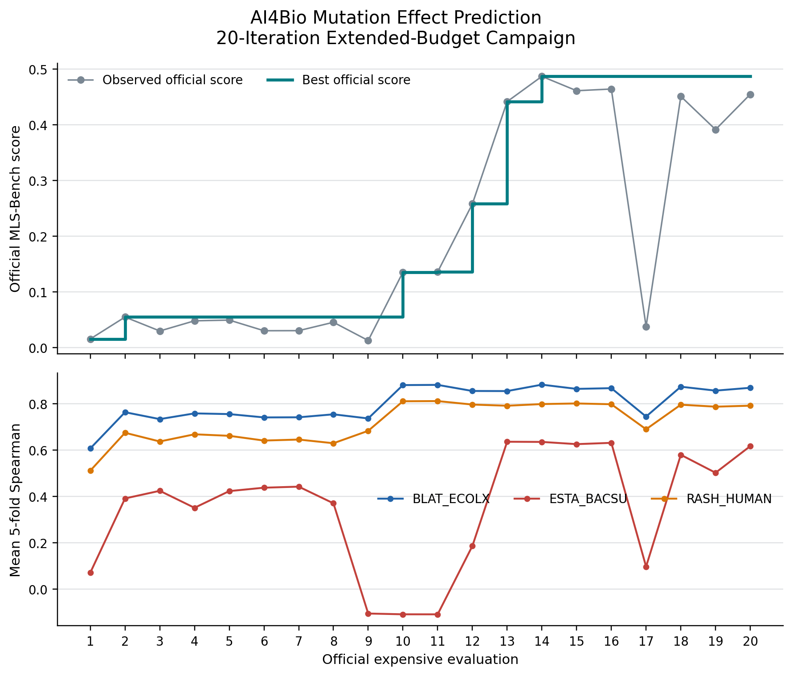

# Registering and Running the AI4Bio Mutation-Effect Task

This note summarizes the end-to-end experience of registering the
`ai4bio_mutation_effect_prediction` task in Large Discovery Models (LDM),
qualifying it against the pinned MLS-Bench contract, and running official
1-, 3-, and 20-iteration campaigns through `delta-cli`.

The most important qualification is that candidate proposal was deterministic
in these campaigns. The expensive evaluation was real: every selected
candidate was trained and scored on the pinned official ProteinGym data with
CUDA, five predefined folds per assay, and the pinned MLS-Bench scorer.

## Outcome

The final 20-iteration extended-budget campaign completed successfully:

| Item | Result |
| --- | --- |
| Delta execution ID | `46987492f47a4ef7a8b4d85c44a7b686` |
| Benchmark commit | `cfd57a7e0139c72753e32e31bca593719b098717` |
| Outer iterations | 20 |
| Valid candidates | 80 |
| Selected candidates | 20 |
| Successful evaluations | 20 |
| Failed evaluations | 0 |
| Official assay jobs | 60 |
| Campaign wall time | 2,152.38 seconds (35 minutes 52 seconds) |
| Best iteration | 14 |
| Best candidate | `predictor-a56244b4c02f` |
| Best official score | `0.4872663032443121` |
| BLAT_ECOLX Spearman | `0.882654` |
| ESTA_BACSU Spearman | `0.635622` |
| RASH_HUMAN Spearman | `0.798968` |
| Parameter count | 360,961 |

The best architecture was:

```json
{
  "feature_mode": "delta",
  "hidden_dims": [256, 128],
  "activation": "relu",
  "dropout": 0.1,
  "layer_norm": false,
  "learning_rate": 0.001,
  "weight_decay": 0.05
}
```

The result trajectory stayed below `0.14` for the first 11 evaluations, then
improved to `0.2583` at evaluation 12, `0.4419` at evaluation 13, and the final
best of `0.4873` at evaluation 14. Later candidates remained competitive but
did not improve the incumbent.



## 1. Understanding the Upstream Task

The first step was to treat the upstream benchmark as an immutable contract,
not as loose example code. The registration pins:

- Repository: `https://github.com/Imbernoulli/MLS-Bench`
- Commit: `cfd57a7e0139c72753e32e31bca593719b098717`
- Task path: `tasks/ai4bio-mutation-effect-prediction`
- Editable file: `ProteinGym/custom_mutation_pred.py`
- Editable regions: the `MutationPredictor` class and optimizer overrides
- Representation dimension: 1,280
- Parameter ceiling: 6,957,956

The parameter ceiling is
`floor(1.05 * 6,626,625)`, where 6,626,625 is the largest bundled baseline.
The adapter records SHA-256 digests for the upstream task, scorer, templates,
leaderboard, and required MLS-Bench source modules. This catches upstream drift
before an evaluation can consume GPU budget.

The official objective is not a raw average of three correlations. Each assay
Spearman is normalized by the pinned MLS-Bench `bounded_power` score relative
to leaderboard anchors, and those normalized setting scores are combined by an
epsilon-floored geometric mean. That distinction matters when interpreting
apparently strong raw assay values.

## 2. Defining a Safe Candidate Domain

The adapter does not accept arbitrary generated Python. A candidate is a strict
JSON architecture specification with bounded choices:

- Feature mode: mutant embedding, mutant-minus-WT delta, or concatenation
- Hidden layers: zero to three
- Hidden width: bounded integers from 16 to 1,024
- Activation: ReLU, GELU, or SiLU
- Dropout: 0.0 to 0.5
- Optional layer normalization
- Learning rate: `1e-5` to `1e-2`
- Weight decay: 0.0 to 0.2

The task code validates the schema, rejects non-finite optimizer values,
deduplicates canonical specifications, computes the parameter count
analytically, and rejects candidates over budget. Only then does it materialize
a benchmark-compatible `MutationPredictor` implementation.

Each accepted candidate is encoded into 15 normalized surrogate features.
The shared exact-RBF Gaussian process uses those features for GP-UCB selection.
This boundary was valuable: the search can vary meaningful architecture and
optimizer choices without allowing generated code to alter data loading,
folds, scoring, or the fixed training pipeline.

## 3. Implementing the LDM Adapter

The registered task is organized around the repository's standard adapter
boundary:

```text
tasks/ai4bio_mutation_effect_prediction/
  task.json                 task discovery and dependency hook
  experiment.json           qualification, metrics, limits, and profiles
  ldm_task/procedure.py      thin LDM procedure entry point
  ldm_task/dependencies.py   dependency-check entry point
  core/candidate.py          schema, canonicalization, and materialization
  core/proposals.py          deterministic and optional OpenAI proposals
  core/surrogate.py          15-dimensional candidate encoder
  core/evaluator.py          mock and pinned official evaluators
  core/workflow.py           campaign construction and budget accounting
  tests/test_procedure.py    contract and resume tests
```

The evaluator performs three jobs per candidate:

1. `BLAT_ECOLX_Firnberg_2014`, 4,783 single mutants.
2. `ESTA_BACSU_Nutschel_2020`, 2,172 single mutants.
3. `RASH_HUMAN_Bandaru_2017`, 3,134 single mutants.

Each job trains for 200 epochs with batch size 64 and AdamW, using the
candidate's bounded learning rate and weight decay. The three assay jobs run in
parallel inside one candidate evaluation. Each assay uses the official random
five-fold assignment, so one candidate produces three `results.pt` files and
15 fold-level Spearman values.

## 4. Qualification Before Real Evaluation

Registration was not considered complete when the files merely existed. The
qualification path covered:

- Task discovery and layout validation
- Candidate parsing, canonicalization, and exact materialization
- Invalid, duplicate, non-finite, and over-budget candidate rejection
- Protection of fixed template regions
- Deterministic reservoir diversity
- Surrogate encoding and GP scoring
- Metric parsing and official aggregation behavior
- Exact budget derivation
- Campaign artifact creation
- Resume behavior without repeating a completed evaluation
- A separately recorded official ridge seed

The service-free qualification path used:

```bash
python scripts/validate_tasks.py \
  --task ai4bio_mutation_effect_prediction

python -m pytest \
  tasks/ai4bio_mutation_effect_prediction/tests -q

python scripts/check_task_dependencies.py \
  config/ai4bio_mutation_effect_prediction/mock.yaml \
  --no-optional

python scripts/run_ldm_tts.py \
  config/ai4bio_mutation_effect_prediction/mock.yaml \
  --dry-run
```

The mock evaluator is deliberately labeled synthetic and non-comparable. It is
useful for testing selection, persistence, contracts, and counters, but it is
not evidence of benchmark performance.

## 5. Preserving Budget Semantics

The primary qualified profile remains a one-evaluation campaign:

```text
1 iteration -> 4 valid candidates -> 1 selection -> 1 evaluation -> 3 jobs
```

Longer runs use separate, explicitly extended-budget profiles. This prevents a
20-evaluation result from being presented as though it used the primary
one-evaluation budget.

| Profile | Iterations | Valid candidates | Evaluations | Assay jobs |
| --- | ---: | ---: | ---: | ---: |
| `official_campaign` | 1 | 4 | 1 | 3 |
| `official_campaign_3_iterations` | 3 | 12 | 3 | 9 |
| `official_campaign_20_iterations` | 20 | 80 | 20 | 60 |

All three lock the same search topology:

```yaml
reservoir-size: 4
evaluations-per-round: 1
proposal-mode: deterministic
acquisition-beta: 1.0
evaluation-timeout: 3540
```

The 20-iteration test asserts every exact counter, including zero LLM requests
and zero proposal attempts. The zero counters are important evidence that this
specific campaign did not call a language model for candidate generation.

## 6. Preparing Delta CLI

Before creating compute, I checked the configured endpoint and authentication
state without printing credentials:

```bash
delta-cli config show
delta-cli auth status
delta-cli sandbox list
```

The campaign used one sandbox for the entire lifecycle:

```text
image:  image.yangtzeailab.com/opensandbox/pytorch-cuda13
cpu:    8
memory: 32 GiB
gpu:    1
gpuMem: 16,000 MiB
life:   600 minutes
```

The repository was staged without `.git`, previous `runs/`, IDE metadata,
virtual environments, `__pycache__`, or `.pyc` files, then uploaded through
`delta-cli sandbox upload`. The final upload integrity check reported 458 files
and 69,908,484 bytes.

Machine-specific paths were never committed into the source config. A runtime
copy of `real_20_iterations.yaml` was created inside the sandbox and populated
with absolute paths for:

- The pinned MLS-Bench source tree
- Qualified ESM-2 embedding tensors
- ProteinGym random-fold CSVs
- The sandbox campaign output directory

The embeddings and fold archive were copied from a previously qualified Delta
workspace cache. This was acceptable because the dependency gate revalidated
the pinned source hashes, tensor shapes, floating finiteness, mutant ordering,
and exact fold IDs before launch. For a more durable production workflow, these
inputs should live in a versioned artifact store rather than another sandbox
workspace.

The base CUDA image already provided PyTorch and CUDA. The setup installed the
remaining small dependency set: `pytest`, `pyyaml`, `pandas`, `scipy`, and
`matplotlib`.

## 7. Running the Authoritative Preflight

The real run was gated by one combined preflight in the same environment that
would execute the campaign:

```bash
python scripts/validate_tasks.py \
  --task ai4bio_mutation_effect_prediction \
  --require-qualified

PYTHONPATH=/path/to/campaign-repo \
python -m pytest tasks/ai4bio_mutation_effect_prediction/tests -q

PYTHONPATH=/path/to/campaign-repo \
python scripts/check_task_dependencies.py \
  config/ai4bio_mutation_effect_prediction/real_20_iterations_runtime.yaml \
  --no-optional

PYTHONPATH=/path/to/campaign-repo \
python scripts/run_ldm_tts.py \
  config/ai4bio_mutation_effect_prediction/real_20_iterations_runtime.yaml \
  --dry-run
```

The preflight evidence was:

- Qualified registration and valid layout
- 18 task tests passed
- Evaluator Python imported NumPy, pandas, SciPy, and PyTorch
- All pinned MLS-Bench SHA-256 digests matched
- BLAT embeddings had shape `[4783, 1280]`
- ESTA embeddings had shape `[2172, 1280]`
- RASH embeddings had shape `[3134, 1280]`
- Embeddings were finite floating tensors in exact mutant order
- Fold IDs were exactly `{0, 1, 2, 3, 4}`
- CUDA device 0 was visible
- The dry run resolved the exact locked 20-iteration profile

This ordering matters: the campaign spent no official evaluation budget until
every static, scientific, and runtime dependency check passed.

## 8. Launching and Monitoring the Campaign

Because the run exceeded 60 seconds, it was launched with Delta's background
execution path and an attached event stream:

```bash
delta-cli sandbox run-bg <sandbox-id> \
  --command "bash <working-directory>/run_campaign_20.sh" \
  --timeout 35000 \
  --wait
```

The launcher changed into the uploaded repository, exported `PYTHONPATH`, and
executed the runtime config. `run-bg --wait` returned the execution ID early
and then emitted keepalive frames until the campaign's final JSON and exit code
were available.

Monitoring used two evidence sources:

1. The attached Delta event stream, which would surface a process or provider
   failure immediately.
2. The persisted `budget.json`, which showed atomically committed counters.

The budget file increments an attempt when a candidate starts, but increments
`successful_evaluations` and `benchmark_jobs` only after all three assay jobs
finish. This explains why monitoring often showed one more attempt than
success. It also made partial or failed candidates easy to distinguish from
slow candidates.

Candidate runtime varied substantially with architecture size. Lightweight
heads completed faster, while larger networks kept the counters unchanged for
several monitoring intervals. Healthy Delta keepalives plus stable atomic
counters were expected during those periods and were not treated as a stall.

## 9. Verifying the Completed Run

Exit code zero was necessary but not sufficient. The final audit required:

- `status=completed`
- `phase=finished`
- `rounds_run=20`
- `successful_evaluation_count=20`
- `failed_evaluation_count=0`
- 80 valid search candidates
- 20 selected candidates
- 20 expensive evaluation attempts
- 20 successful evaluations
- 60 benchmark jobs
- 20 evaluation directories
- 20 successful evaluation manifests
- 60 `results.pt` files
- Five finite fold Spearmans in every result file
- 300 finite fold-level Spearman values in total
- `record_valid=true` in every scoring manifest

The required raw campaign evidence was also checked:

```text
campaign.json
budget.json
status.json
checkpoint.json
events.jsonl
experiment_contract.json
ldm_task_spec.json
search_manifest.json
selection_record.json
summary.json
```

The task-specific exporter then derived `progress.csv` directly from
`checkpoint.json`, computed the best-so-far curve, and created `progress.png`
and `progress.pdf`. The PNG was checked for dimensions, file size, and nonblank
pixel variation, then inspected visually. The final image is 1,780 by 1,517
pixels.

## 10. Pulling Results and Cleaning Up

The complete raw campaign was pulled through Delta with recursive integrity
checking:

```bash
delta-cli sandbox pull <sandbox-id> \
  --source <working-directory>/campaign_runs/official_campaign_20 \
  --target runs/ai4bio_mutation_effect_prediction/official_campaign_20 \
  --recursive
```

This transfer contained 432 entries and 1,230,297 bytes. It took about 887
seconds because the CLI materialized and verified files individually. The
generated result bundle contained four files and 242,405 bytes.

Cleanup exposed one infrastructure edge case. The first `sandbox kill` request
returned a typed provider API error and said the database record was retained
for reconciliation. A follow-up status query reported the live sandbox as not
found, and the filtered sandbox list reported its final state as `finished`.
The practical lesson is to verify final lifecycle state after a typed cleanup
error instead of assuming either success or failure from the first response.

## 11. What Worked Well

### Pinning before adaptation

Recording the upstream commit and file hashes made the evaluator auditable and
prevented accidental benchmark drift. This was more valuable than relying only
on a Git commit string because the exact files used by the adapter were checked
at runtime.

### Separating mock and official metrics

The synthetic qualification score exercised LDM behavior cheaply without being
misrepresented as benchmark evidence. Official score fields appear only in the
real evaluator path.

### A structured candidate language

Using strict architecture JSON instead of arbitrary generated code kept the
scientific contract fixed. It also made canonical deduplication, analytical
parameter checks, and surrogate encoding straightforward.

### Locked budget profiles

Separate one-, three-, and 20-iteration profiles made comparisons honest and
allowed exact counter assertions. The extended campaign did not silently alter
the primary benchmark budget.

### Durable campaign artifacts

The checkpoint, event log, budget, status, selection, and per-evaluation
manifests made it possible to monitor and audit the run without parsing console
output. They also supported a reproducible plot after the sandbox was gone.

### One sandbox for the full lifecycle

Using a single sandbox avoided asset duplication, inconsistent environments,
and abandoned GPU allocations. Setup, preflight, campaign, verification,
plotting, pulling, and cleanup all referred to one working directory.

## 12. What I Would Improve Next Time

### Build a narrower upload bundle

The staged repository was about 68 MiB because it included unrelated tracked
assets, including a large model for another task. A task-aware source manifest
could reduce upload time while still including shared LDM modules and registry
metadata.

### Use a versioned official-data artifact

Reusing a previous Delta workspace was safe only because the strict dependency
gate revalidated every scientific invariant. A versioned, checksum-addressed
artifact in durable storage would be easier to reproduce and would remove the
dependency on another sandbox's retained workspace.

### Emit concise progress records

The campaign produced most output only at completion, so monitoring depended on
reading `budget.json`. Emitting one concise JSON progress line per committed
round would make the Delta stream more informative while preserving the
artifact files as the source of truth.

### Pull a compact evidence archive first

The full raw pull took longer than the campaign setup because recursive Delta
verification processed hundreds of small files. A compact tar archive plus a
manifest could provide fast disaster recovery, followed by the expanded tree
when needed for inspection.

### Make cleanup reconciliation explicit

The provider eventually reported the sandbox as `finished`, but the first kill
response was ambiguous. An explicit CLI command that waits for reconciled
terminal state would make GPU cleanup easier to reason about.

### Add tests for the result exporter

The exporter correctly handled omitted zero-valued runtime counters by
canonicalizing against the contract. A small fixture-based test should lock
that behavior and validate plot/CSV generation without requiring a real run.

## Reproduction Checklist

1. Pin the upstream source and record hashes for every evaluation-critical
   file.
2. Define a strict candidate schema and analytical budget checks.
3. Implement thin task hooks around shared LDM interfaces.
4. Keep mock qualification explicitly non-benchmark.
5. Add an official dependency checker for source, tensors, folds, imports, and
   CUDA.
6. Qualify the primary budget before defining extended profiles.
7. Assert exact locked counters for every profile.
8. Check Delta configuration and authentication without exposing credentials.
9. Create one appropriately sized sandbox and upload a clean source bundle.
10. Materialize machine-specific paths only in a protected runtime config.
11. Run registration, tests, dependency checks, and a dry run before launch.
12. Use `run-bg --wait` for the long campaign and retain the execution ID.
13. Monitor both the Delta stream and durable campaign counters.
14. Audit status, counters, manifests, result tensors, and fold values.
15. Generate presentation artifacts from persisted evidence, not console logs.
16. Pull raw and generated artifacts with integrity verification.
17. Confirm local JSON, CSV, image, and task-registration validity.
18. Destroy the sandbox and verify its terminal lifecycle state.

## Artifacts

- [`result.json`](./result.json): concise structured campaign result
- [`progress.csv`](./progress.csv): all 20 evaluations and best-so-far values
- [`progress.png`](./progress.png): raster trajectory plot
- [`progress.pdf`](./progress.pdf): vector trajectory plot
- `runs/ai4bio_mutation_effect_prediction/official_campaign_20/`: complete raw
  campaign evidence from the Delta sandbox

