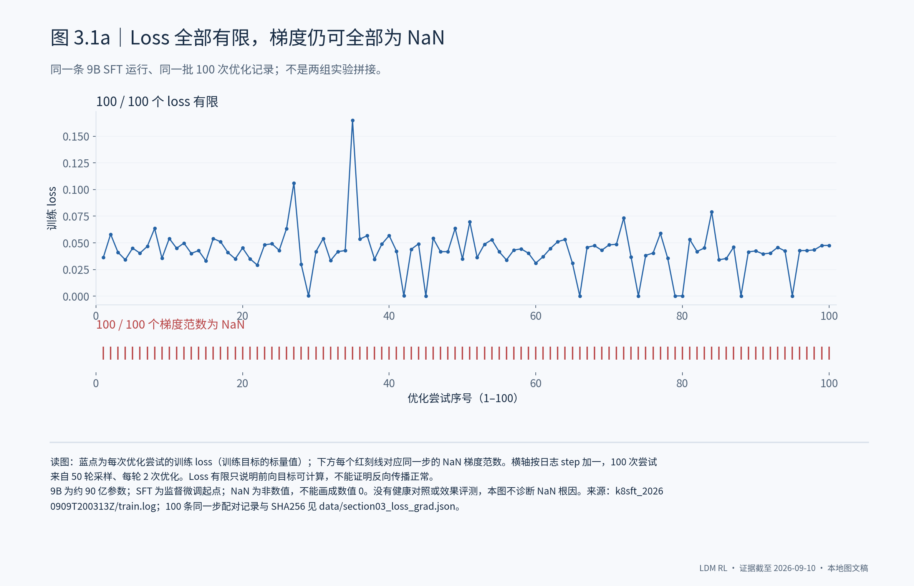
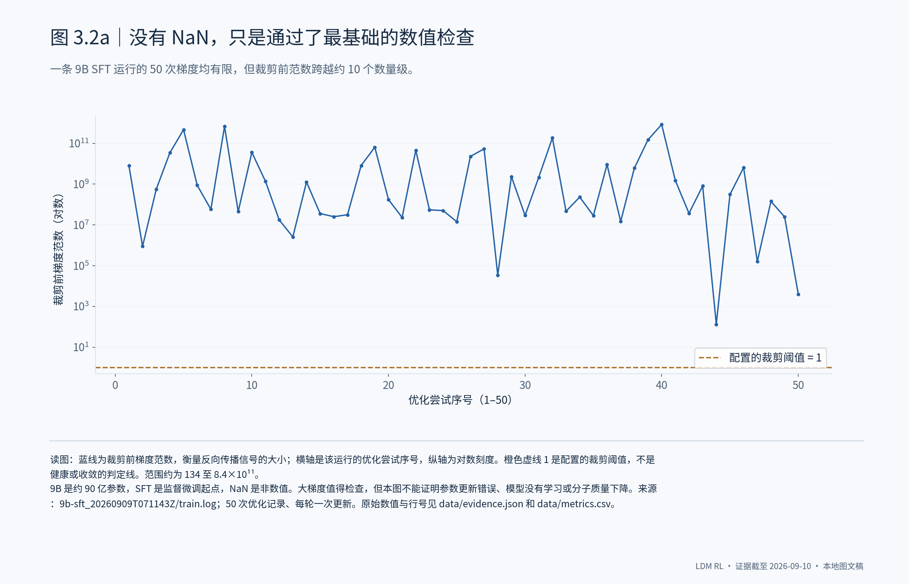
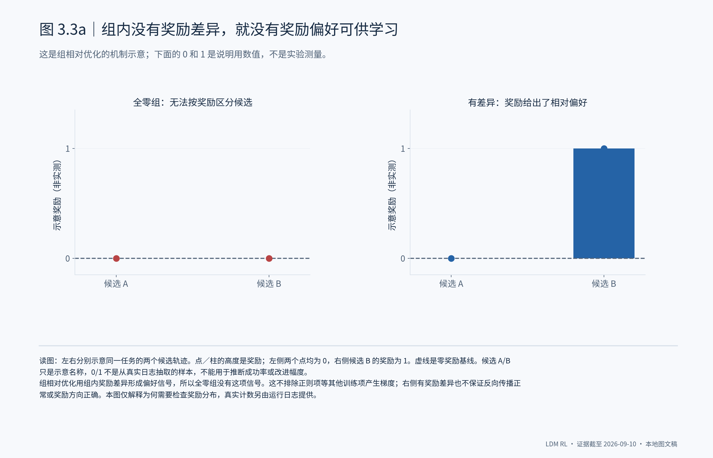
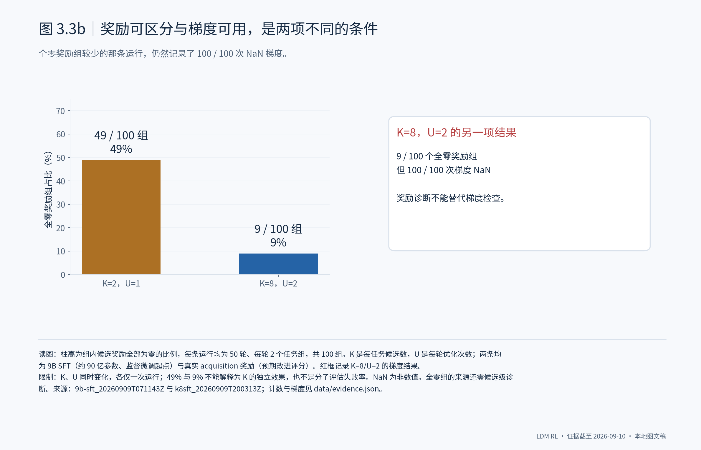
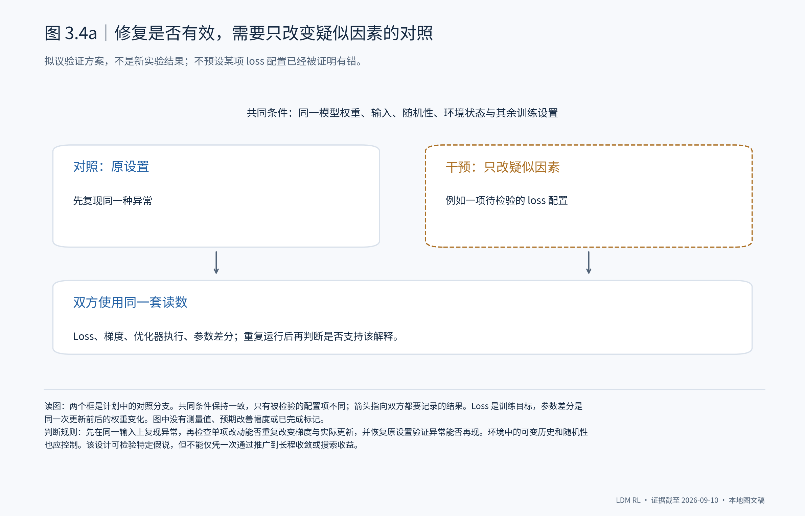

# 3. 训练为什么还不能证明有效学习：从异常结果追到优化过程

## 3.1 Loss 是有限数值，为什么还不能说明训练正常？

在一条 9B SFT 分子搜索训练中，loss 能正常输出，但与它逐步配对的 100 次优化记录，梯度范数全部是 NaN。**前向目标能算出一个数，并不保证反向传播能提供可用的更新信号。** 这条运行虽然完成了 50 轮采样，仍不能凭 loss 有限或运行完成来证明训练成功。

**这里已经证实的是梯度有限性检查失败，尚未证实的是失败的具体原因。** 仅凭这些记录，不能断言某一层、某个算子或某项 loss 配置有问题。下一步应在固定输入上定位首个非有限中间量，再用单因素对照检验解释；这是拟议验证，不是已完成的修复。

## 3.2 没有 NaN 的运行，是否就已经解决了问题？

另一条 9B SFT 运行的 50 次梯度记录全部有限，但裁剪前范数从约 134 跨到 8.4×10¹¹。它说明检查不能只停在“有没有 NaN”：**有限数值仍可能伴随很大的训练信号变化。** 不过，这个范围本身不足以证明优化器失效，也不能据此判断模型已经收敛或没有学习。

梯度裁剪、优化器状态和数值精度都会影响最终更新。要判断这条 9B 运行是否可靠地改变了模型，需要把同一次更新的梯度处理、优化器执行和参数差分连起来，再核对固定输入上的输出变化。**本章尚未提供完成这组联合检查的证据，所以不把“梯度有限”写成“问题已解决”。**

## 3.3 奖励没有差异时，训练缺少的是什么？

组相对优化依靠同一任务下候选轨迹的奖励差异来形成偏好。如果一组候选全部拿到零奖励，就没有这项信号供模型学习。**这与优化器能否计算梯度是两个问题。** 下面用明确标为示意的候选奖励解释机制，不把人为数字当作实验结果。

两条 9B SFT 运行中的全零奖励组分别占 49% 和 9%，但后一条运行的 100 次梯度仍全部为 NaN。**奖励更能区分候选，并不保证更新信号可用；梯度正常也不保证奖励指向更好的分子。** 当前计数还不能区分评估失败、没有改进或候选相似等来源，因此不能把增大采样数当成已经验证的修法。

## 3.4 什么结果才能说明这些问题真的被解决了？

如果怀疑某项 loss 配置造成训练异常，就应在同一模型和输入下，只改变这一项，检查异常是否可重复地消失、优化器是否实际更新，以及参数变化是否一致。**修复必须由前后可比的实验支持。** 短程验证通过后，还需要更长训练中的稳定性证据，以及同预算的分子搜索评测；下面是验证设计，不是执行结果。

**当前结论是：已经识别出梯度数值异常和奖励偏好信号缺失，但尚未建立完整的根因与修复证据链。** 这两类观测分别约束训练能否更新、奖励能否指导更新；只有把它们连到可靠的参数变化，并最终比较 RL 与 SFT 的搜索成绩，才能进一步讨论收敛和实际收益。

