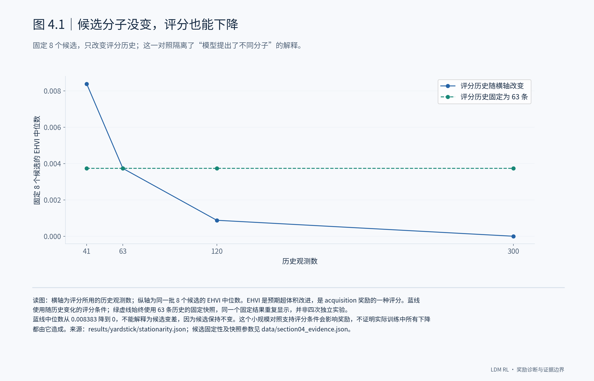
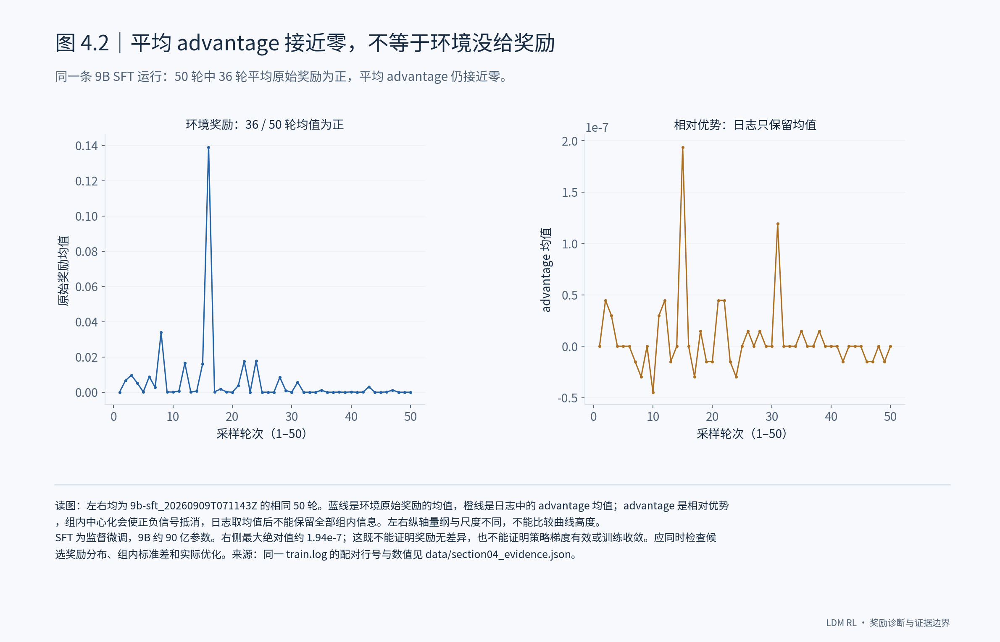
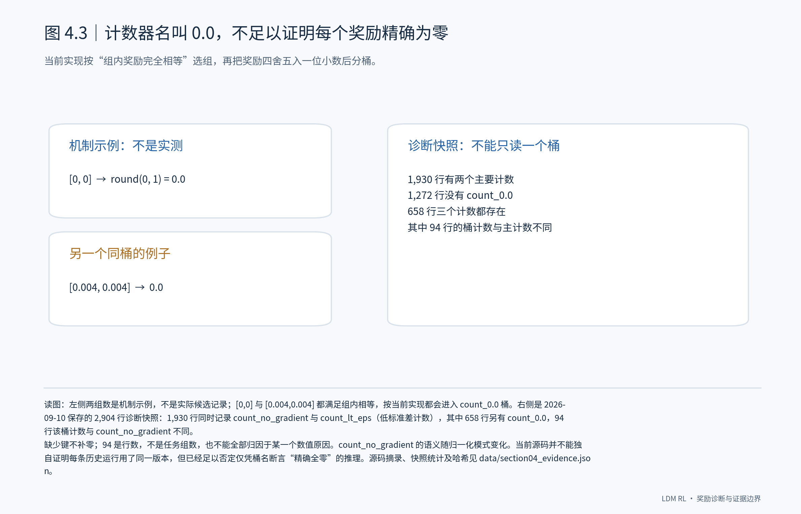
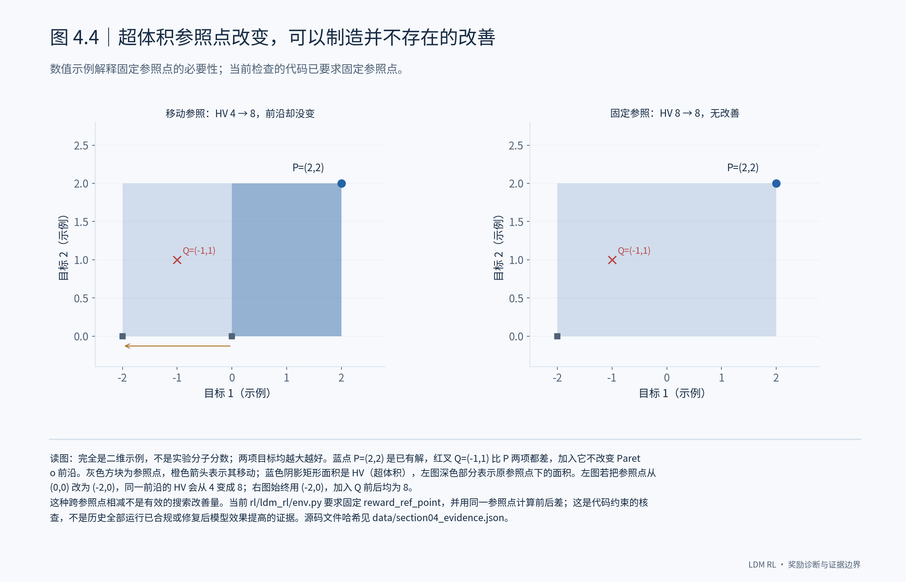

# 4. 奖励与指标：什么证据才足以说明模型学得更好？

## 4.1 奖励下降，首先要排除评分条件发生变化

判断模型有没有进步，首先要知道评分标准有没有变。已有的一项对照固定了同一批 8 个候选分子，只改变评分所用的历史观测：历史从 41 条增加到 300 条时，预期超体积改进（EHVI）的中位数从约 0.00838 降到了 0。固定历史快照后，同一批候选的评分保持不变。**这说明奖励下降可以来自评分条件变化，不能直接解释为模型退步。** 我的判断是，训练曲线可以用来发现问题，但模型好坏还得放到固定条件下比较；这 8 个候选的对照还不足以解释所有训练中的奖励变化。

## 4.2 日志里的平均相对优势，不是环境奖励本身

另一处容易误读的是日志里的平均 advantage，也就是相对优势。一条以监督微调模型为起点的 9B 运行中，50 轮采样有 36 轮的平均原始奖励为正，但平均相对优势始终接近零，最大绝对值约为 1.94e-7。**组内中心化会让正负相对优势在平均时抵消，所以这个均值不能告诉我们模型有没有收到有效的学习信号。** 要回答这个问题，我会看每组候选的奖励差异，再看这些差异是否形成了可用的梯度和参数更新。

## 4.3 必须按实现解释计数器，不能按名字解释

这里需要纠正前文的一处解释：49/100 和 9/100 不能直接写成“全零奖励组”。当前检查的代码会把组内相等的奖励四舍五入到一位小数后分桶，因此 count_0.0 也可能包含非零奖励。历史快照中，三个计数都存在的 658 行里，有 94 行的这个桶计数与 count_no_gradient 不同。**这两组比例应保留为运行报告的 count_no_gradient 计数，原始奖励是否全部为零还需要逐候选核实。** 接下来还要确认每次历史运行实际用了哪个版本，避免拿当前实现代替当时的计算过程。

## 4.4 奖励必须奖励结果改善，而不是计量方式的变化

我希望奖励的增加能够对应搜索结果的改善。以超体积改善（ΔHV）为例，如果计算前后换了参照点，即使最优候选集合没有变化，也可能算出正的“改善”；图中的二维例子说明了这个问题。当前检查的代码已经要求固定 reward_ref_point，并用同一个参照点计算前后差。**这个约束保证比较口径一致，但还不能证明模型已经学得更好。** 最终要看的是：在相同任务、搜索预算和参照点下，强化学习模型（RL）能否比监督微调起点（SFT）找到更好的分子。

