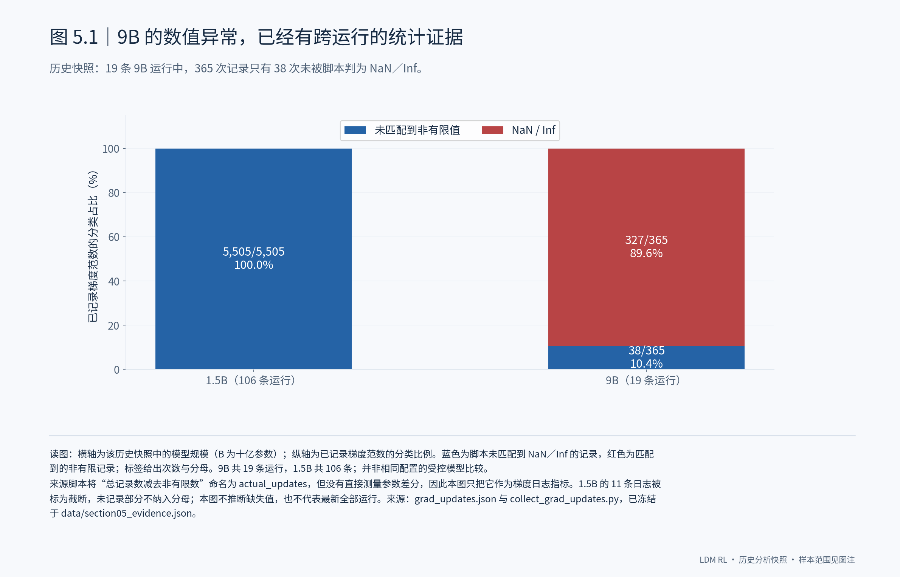
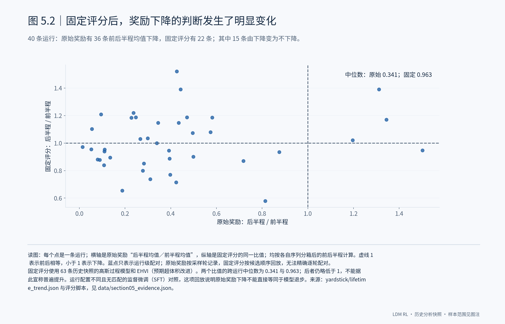
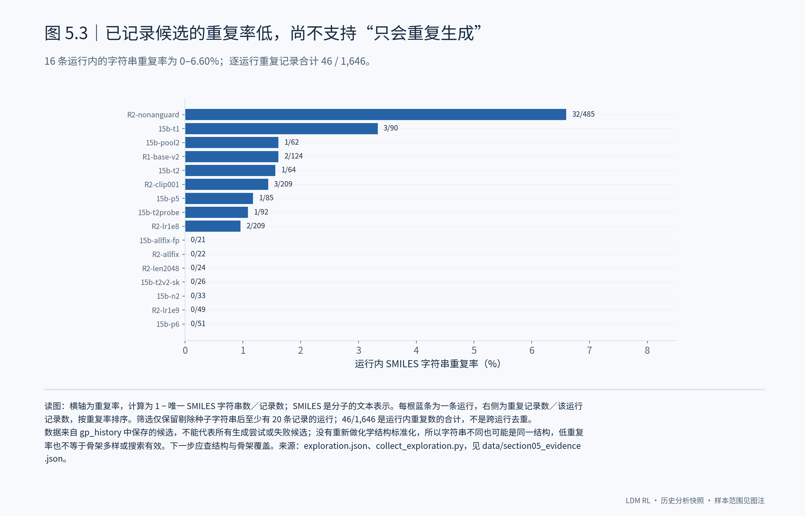
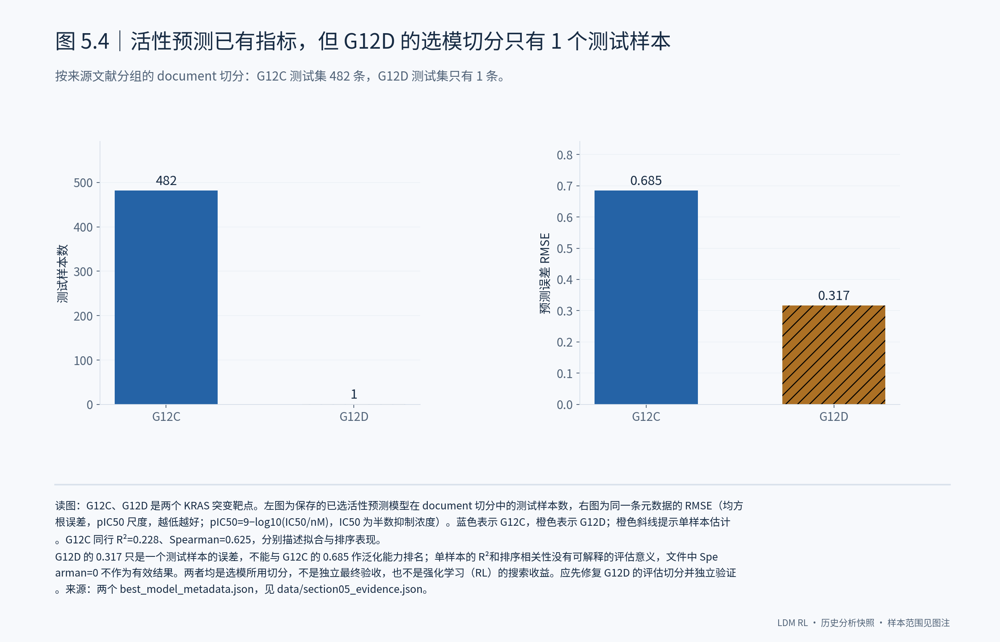

# 5. 已有定量结果说明了什么，下一步该查哪里？

## 5.1 数值异常已有统计，参数更新还要直接验证

历史梯度汇总已经给出了明确的诊断信号：19 条 9B 运行的 365 次梯度记录中，327 次被脚本判为 NaN 或 Inf，只有 38 次没有这一标记；106 条 1.5B 运行的 5,505 次已记录梯度则没有这类标记。**这使 9B 的梯度数值路径成为优先排查对象，但还不能把差异归因于模型大小。** 两组配置不同，而且原脚本把非异常记录直接命名为 actual_updates，并未测量参数差分。我会把这项统计作为排查入口，再固定输入定位首个异常，并直接检查优化器执行和参数变化。

## 5.2 固定评分回放已有结果，不能再只盯原始奖励曲线

40 条运行的历史回放中，按前后半程均值判断，原始奖励下降的有 36 条，固定评分下降的有 22 条；其中 15 条在固定评分后不再下降。后半程与前半程的比值，中位数也从原始口径的 0.341 变为固定口径的 0.963。**评分条件确实会改变我们对训练趋势的判断。** 不过，两条序列只能按运行进度比较，不能精确逐轮配对；固定评分的中位数仍略低于 1，也没有匹配的 SFT 对照。下一步应保存候选与采样轮的对应关系，让趋势分析能够落实到同一批候选。

## 5.3 已保存候选的重复率不高，但结构多样性仍需核实

已有的 16 条运行统计里，剔除种子后，每条运行的 SMILES 字符串重复率在 0 到 6.60% 之间；逐运行重复记录合计为 46/1,646。**这些数据暂不支持“已保存的候选主要是在重复同一个字符串”这一解释。** 但它只覆盖写入历史的候选，而且不同字符串可能表示相同结构。我会继续检查标准化结构和分子骨架的覆盖，并把未通过解析或评估的生成也纳入记录，判断模型是否真的在扩大有效搜索范围。

## 5.4 活性预测已有误差指标，G12D 的单样本切分需要先处理

活性预测也已经有定量结果。保存的 G12C 已选模型在 document 切分的 482 个测试样本上，RMSE 为 0.685、R² 为 0.228、Spearman 相关系数为 0.625；但 G12D 已选模型在同类切分下只有 1 个测试样本，RMSE 为 0.317。**后一个更小的误差不能说明 G12D 模型更好，单样本也无法评估排序能力。** 这给出了一个具体需要处理的问题：检查按文献分组后的样本分布，建立足够的独立测试覆盖，再评估活性预测是否能可靠指导搜索。现有指标来自选模切分，不能当作独立验收，更不能当作 RL 相对 SFT 的收益。

