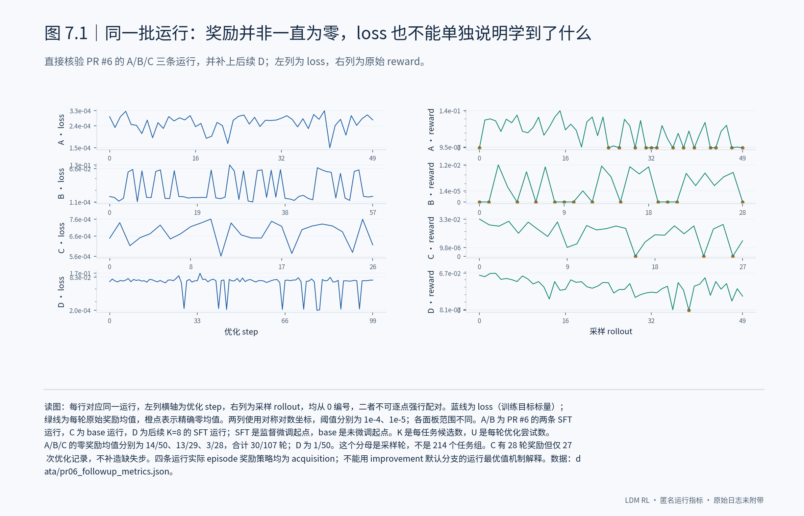
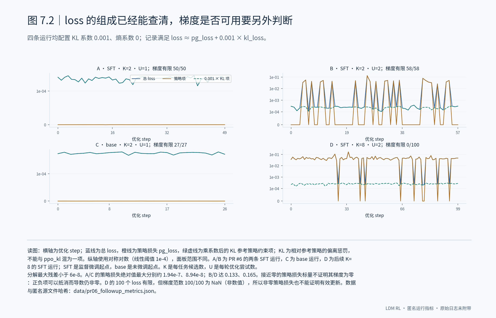

# 7. 回到 PR #6：同一批运行的 loss 与 reward

## 7.1 先看同一批运行的 loss 和原始 reward

我重新核验了 PR #6 的三条原始运行，并加上后续 K=8 运行。前三条运行中，原始奖励均值为零的是 30/107 个采样轮，而不是奖励一直为零；104/214 则是另一项按任务组统计的计数。**这两个分母不能混用。** 四条运行的实际 episode 奖励策略都是 acquisition，所以 PR #6 按 improvement 默认分支解释“必须超过历史最好值”的说法，不能直接用于这些曲线。图中把优化 step 与采样轮分开保留，也没有为少一条优化记录的 base 运行补造数据。

## 7.2 loss 接近零，不等于策略梯度为零

四条运行的 loss 都能由策略项与 0.001 倍 KL 约束项解释，最大残差低于 6e-8。A/C 的策略损失标量接近零，B/D 则出现了明显非零的策略项。**不能由策略损失的标量为零推断梯度为零，也不能由它非零推断更新正常。** 最直接的反例是 D：100 个 loss 都有限，但同一步的梯度范数全部为 NaN。接下来应在固定输入下分别检查奖励形成的相对优势、策略项的梯度和优化器实际更新，而不能把所有问题都归到 K=2。

