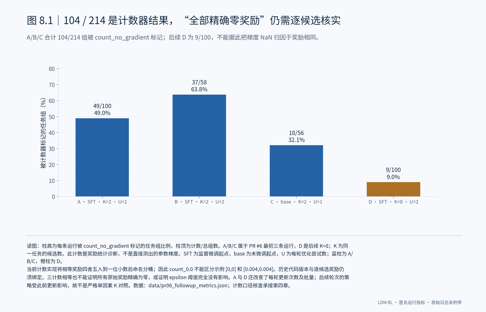
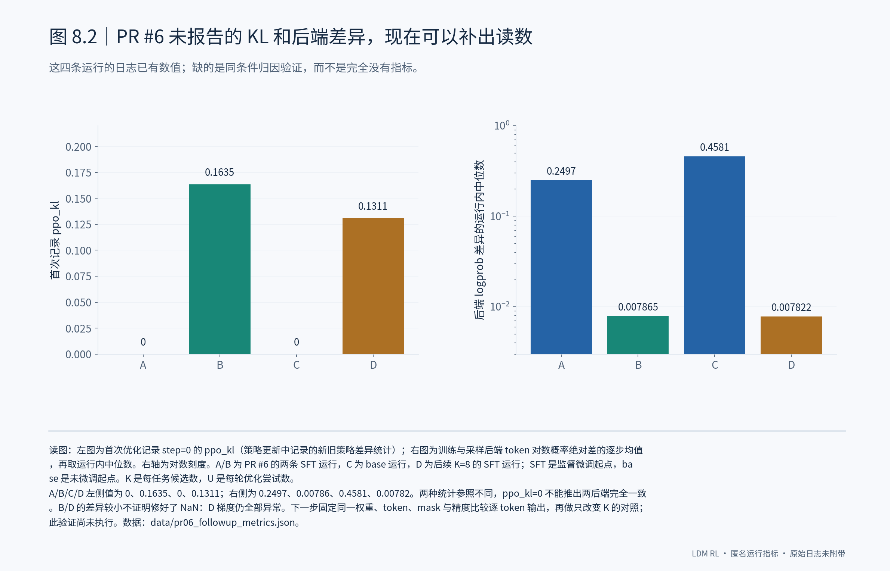

# 8. PR #6 的结论怎样修正，剩余问题怎样验证

## 8.1 保留 104/214 的观测，收回“全部精确为零”的推断

三条运行的 count_no_gradient 累计为 49/100、37/58、18/56，合计 104/214；后续 K=8 运行是 9/100。**这些数字可以保留，但“104 个组的每个奖励都精确为零”尚缺逐候选证据。** 当前实现会将奖励舍入后命名为 count_0.0，因此桶名和计数相等并不足以得出该结论。K=2 的标准化相对优势主要保留胜负方向，这仍然可以提供学习信号；它不等于整个运行必然学不到东西。

## 8.2 补出已有诊断，再把需要验证的因果问题列清楚

PR #6 没有报告的首次 ppo_kl 和训练—采样后端 logprob 差异，可以从同一批日志补出；它们的数值和分母见图。**目前可以说不同运行的这些指标明显不同，但不能说某一项改动已经解决问题。** A 与 D 除了 K=2→8，还改变了每轮更新次数和 global batch；即使计数发生在当前轮更新前，后续采样也受以前的更新影响。我会先固定权重、输入 token、mask 和精度核对两后端，再只改变 K、固定更新次数与预算口径做对照；同时保存逐候选 reward、组标准差、失败原因和优化器是否跳步，才能把奖励问题与数值问题分别定位。

