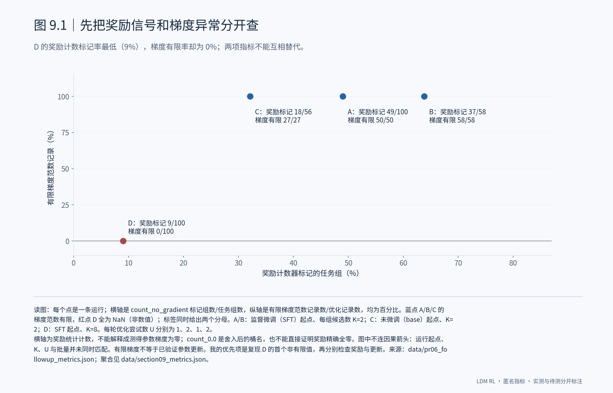
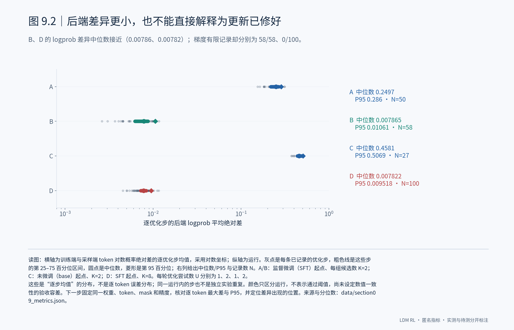
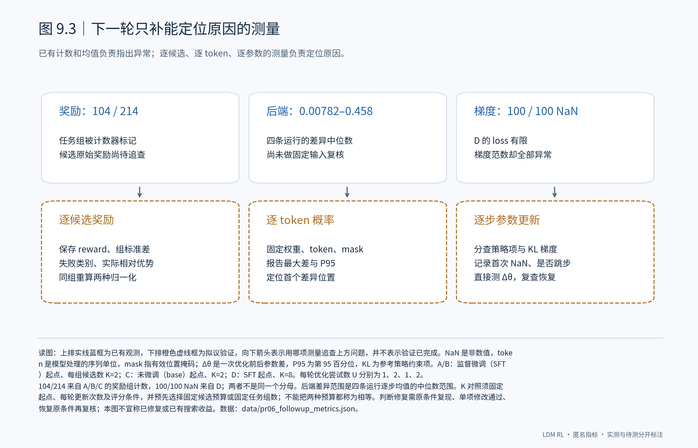

# 9. 对 PR #6 的回应：已有指标决定下一步查什么

## 9.1 先定位数值异常，再判断奖励是否足够

我会先复现 K=8 运行的梯度异常。它的奖励计数标记率只有 9%，但梯度范数 100/100 为 NaN；改善奖励区分度还没有解决更新问题。

## 9.2 后端差异要固定输入复核

B、D 的后端差异中位数几乎相同，梯度状态却相反。我会把比较推进到同一权重和输入下的逐 token 输出，避免把运行间差异直接当作修复证据。

## 9.3 下一轮的测量与验收

下一轮我只补三类测量：逐候选奖励、逐 token 概率、逐步参数变化。先复现原异常，再只改一个因素复核；通过后才做匹配预算的搜索效果比较。

