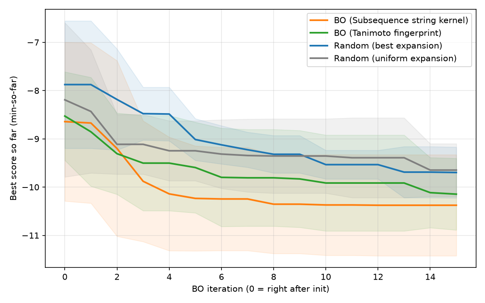

# Bayesian Analog Search over SMILES

This report documents the iterative search procedure implemented in
`strbo_v1/` and exercised by `run_search.sh`. The goal is to find
synthesizable molecules with low AutoDock-Vina binding scores against
a fixed receptor, starting from a small set of literature seed SMILES
and growing the candidate set on the fly through ReaSyn-based analog
generation.

## 1. Background

The space of drug-like molecules is combinatorially infinite, and
even within a single chemotype the number of reachable analogs is
astronomical. SMILES strings are a compact linear encoding of
molecular graphs, but the SMILES space is not a metric space, has no
natural ordering, and cannot be enumerated or sampled uniformly.
A naïve grid or uniform-random search over SMILES is therefore
infeasible: there is no way to draw a "representative" sample, and
two strings that differ by a single character can correspond to
molecules that are either nearly identical or completely
disconnected in chemistry.

Concretely, our objective is a single scalar — the best Vina
binding-energy score (kcal/mol, lower is better) — produced by an
expensive oracle: docking a molecule against a receptor takes
seconds to minutes. The challenge is therefore *not* that the
objective is hard to evaluate, but that the search space is so
vast that we cannot afford to evaluate a representative slice of
it. What we want is a search procedure that

1. *respects the SMILES structure* — generates chemically plausible
   candidates instead of gibberish;
2. *exploits prior observations* — focuses evaluation on regions
   that have already produced good scores;
3. *bounds the budget* — admits a small fixed number of oracle calls
   and produces the best molecule it can within that budget.

Bayesian optimization (BO) is the standard tool for (1)–(3) when the
search space admits a similarity kernel. SMILES, despite not being
a metric space, does admit *chemically meaningful* similarity
measures: Tanimoto similarity over Morgan fingerprints, or
subsequence string kernels over the raw characters. Combined with a
generative model that can produce *new* SMILES *near* observed ones,
BO becomes a natural fit.

## 2. Method

### 2.1 The local search space

Because SMILES cannot be sampled globally, our search space is
*defined implicitly* by an analog generator: a callable that takes
a list of seed SMILES and returns a list of synthesizable
neighbors. We use ReaSyn (NVIDIA NV-ReaSyn-AR-166M + NV-ReaSyn-EB-174M
v2) as the analog generator. The *reachable neighborhood* of the
initial seed set, grown iteratively through ReaSyn, is the
*dynamic local search space* explored by BO. At any round the BO
loop sees a finite set of pending candidates (the **pool**), and
each scored candidate expands the pool through ReaSyn.

The pool is implemented as a `set[str]` for O(1) dedup against
already-pooled or already-evaluated molecules; canonicalization
through RDKit keeps the membership check robust to syntactic
variants. Novel, valid analogs are added; duplicates and parse
failures are silently dropped.

### 2.2 The BO loop

Each trajectory proceeds in three phases, implemented in
`strbo_v1/bayesian_analog_search.py`. **All three phases make a
single batched call to the analog generator** (no per-SMILES calls):

1. **Warm-up** (optional). A single batched call to
   `analog_fn(targets)` where `targets` are sampled from the pool
   to grow it to `init_size`. No scoring, no history writes.
2. **Initialization**. Sample `init_size` SMILES from the pool
   without replacement, batch-score them with Vina, then make a
   single batched call to `analog_fn(init_chosen)` and add the
   resulting analogues back to the pool. This produces the initial
   training set for the GP.
3. **BO loop**. Repeat `n_iterations` times:
   1. Fit a Gaussian-process surrogate on the history.
   2. Score every pool member with the acquisition function.
   3. Take the top-`batch_size` as candidates, batch-score them,
      append to history, then make a single batched call to
      `analog_fn(candidates)` and add the resulting analogues back
      to the pool.

The candidate pool is a `FIFOSet` (FIFO-ordered queue with O(1)
membership) from `strbo_v1.utils`. Setting
`BayesianAnalogSearchConfig.max_pool_size` bounds the queue; when
full, the oldest entry is auto-evicted on append so memory and GP
inference cost stay bounded even if analog generation outpaces
scoring.

Analogue SMILES whose canonical form (or stripped raw text, when
`canonicalize_pool=False`) is longer than `smiles_max_len` (default
50) are dropped at the pool-ingestion step in the warm-up,
initialization, and BO phases. The same value drives the GP string
kernel's int64 tensor padding (`GPConfig.smiles_maxlen`), so the
pool never accumulates candidates the GP would have to truncate at
fit time. The same cap is used by the random search loop and the
`--smiles-max-len` CLI flag.

The loop is parameterized by `BayesianAnalogSearchConfig` (init/batch
sizes, acquisition choice, GP configuration, warmup toggle). The
`scorer` is a `Scorer` callable (one score per input SMILES); the
`analog_fn` is a single batched callable matching
`Callable[[Sequence[str]], Sequence[str]]` — a flat
sequence-to-sequence contract that the search loops consume
directly. The canonical implementation,
`strbo_v1.analog.generate_analogs`, returns a `pandas.DataFrame`
with a `target` column (input SMILES) and a `smiles` column
(analogue SMILES); `run_search.py::_build_reasyn_analog` wraps it
with a closure that flattens the DataFrame to a `list[str]`. This
is the single point in the codebase that knows about the
DataFrame representation. The search loops never see one.

### 2.3 The GP surrogate (two kernels)

`strbo_v1/gp.py` exposes a single `GPSurrogate` class with two
kernel implementations, selected by `GPConfig.impl`:

- **`fingerprint+tanimoto`**. RDKit Morgan fingerprints (default
  radius 2, 2048 bits) are computed for each SMILES, and a
  Tanimoto-similarity kernel is used. This is the classical
  cheminformatics baseline and is fast on GPU.
- **`smiles-strkernel`**. Raw SMILES strings are passed to a
  subsequence string kernel (GAUCHE's `SubsequenceStringKernel`),
  with the alphabet auto-built from the training set. SMILES
  unknown characters at predict time pad to zero. This kernel
  captures *character-level* similarity, including substructure
  motifs that Morgan fingerprints may coarsen away.

Both implementations share the outer API: `fit(smiles, scores)`
trains the GP hyperparameters with Adam under a Cholesky-jitter
ladder (1e-6 → 1e-1, multiplied by 10× per attempt), and
`predict(smiles)` returns `(mean, std)`. When every jitter attempt
fails, the surrogate falls back to **prior mode** — hyperparameters
left at initialization, no observed data — so the BO loop never
sees a `None` surrogate. Standardization of the training scores
is the default (`standardize_y=True`), with automatic fallback to
un-normalized values when the score standard deviation is zero.

### 2.4 Acquisition and acq_budget

Three acquisition functions are supported, all returning
*"higher = better"* so the top-k selection is uniform:

- **Expected Improvement** (EI, default) and **Probability of
  Improvement** (PI), each with an `xi` improvement threshold.
- **Upper Confidence Bound** (UCB) with a `kappa` exploration
  weight.

When the pool is large, the per-round cost of evaluating the
acquisition function is dominated by GP inference, especially
for the string kernel. To bound this, `acq_budget` optionally
subsamples the pool uniformly at random before the GP predict
step; the top-`batch_size` are then taken from the subsample.
The two BO methods in this experiment use different
`acq_budget` values — 2000 for Tanimoto, 200 for the string
kernel — reflecting their different per-evaluation costs.

### 2.5 Scorer backends

The search loops consume any callable matching
`Callable[[Sequence[str]], Sequence[float]]` (the
`Scorer` TypeAlias in `strbo_v1/scorer.py`). Three backends are
wired in via `--objective {vina,nn,mock}`:

- **`vina`** (default) — `strbo_v1.objective_vina.VinaScorer`. The
  AutoDock Vina path is fixed at `VinaScorer.__init__` time;
  receptor prep is cached on disk under
  `VinaScorerConfig.cache_dir/receptors/`. Docking failures yield
  `float("nan")`, which the loop's `_safe_score` converts to
  `None` and excludes from the GP fit.
- **`nn`** — `strbo_v1.objective_nn.NNScorer`. Loads a joblib
  regression model (default:
  `activity_modeling/best_g12d_model.joblib`, an
  `ensemble_nn_ridge_lidge_lgbm` averaging Tanimoto-KNN,
  char-tfidf Ridge, and Morgan+LightGBM, trained on ChEMBL KRAS
  G12D direct-assay IC50). Output is predicted pIC50 (higher = more potent);
  SMILES are canonicalized via RDKit (`isomericSmiles=True`)
  before scoring. `NNScorerConfig.on_error` controls batch-level
  inference-failure behaviour: `"all_nan"` (default) keeps the
  BO loop running on a broken batch, `"raise"` propagates the
  exception.
- **`mock`** — `run_search.mock_carbon_scorer` (linear in atom
  counts). No compute, no dependencies. Useful for CPU-only smoke
  runs of the search loop.

Multi-objective (`vina+nn`, `vina+nn+mock`, ...) is a ``+``-joined
combination of the above. See §2.6 below.

### 2.6 Multi-objective BO

The search loops accept a single scorer or a tuple of scorers;
``--objective`` parses ``+``-joined names. Per-backend minimize
direction is hard-coded (``vina`` and ``mock`` minimise; ``nn``
maximises); the JSON ``config.minimize`` echoes the resulting tuple.
``--minimize`` was removed in this version.

#### 2.6.1 Algorithm dispatch by `n_obj`

| `n_obj` | Acquisition | Notes |
|---|---|---|
| 1 | EI / PI / UCB on the GP posterior | Legacy single-obj path. |
| 2 | Expected Hypervolume Improvement (Monte Carlo, `n_samples` draws per candidate) | One GP per objective, shared `gp_config`; `mu` / `sigma` are 2-tuples of `(n_candidates,)` arrays. |
| ≥ 3 | Chebyshev ParEGO scalarization | One GP per objective. Each BO round samples **one** simplex weight vector `λ ~ Beta(α, α, ...)` (α=1 = uniform; CLI: `--che-alpha`); the candidate with the smallest Chebyshev scalarized value is selected. Works in arbitrary dimensions. |

`hypervolume` (the public function) is **exact** in 1D and 2D and
raises `NotImplementedError` for `n_obj >= 3` (the 2D backend is
sweep-line; 3D+ is intentionally not implemented in this version).
`expected_hypervolume_improvement` raises `NotImplementedError` for
`n_obj != 2`; for `n_obj >= 3` the outer interface falls back to
Chebyshev ParEGO. The two helpers live in `strbo_v1.acquisition`.

#### 2.6.2 Reference point (per-backend default)

`strbo_v1.scorer.DEFAULT_REF` is a registry mapping backend names to
default reference-point values:

| Backend | Default ref | Units / meaning |
|---|---|---|
| `vina` | `0.0` | kcal/mol: 0 is a neutral upper bound; more negative = stronger binding. |
| `nn` | `5.0` | pIC50: literature baseline (pIC50=5 → 10 µM, weakly active). |
| `mock` | `0.0` | mock-scorer neutral value. |

`--ref-point X,Y` overrides the default per-run; the per-objective
value is matched positionally to the `+`-joined `--objective` parts.
Unknown backend names fall back to `0.0`. The registry is mutable
at runtime via `strbo_v1.scorer.register_ref(name, default)`.

#### 2.6.3 CLI

```bash
# 2-objective EHVI
python run_search.py --objective vina+nn --method bo-tanimoto \
    --num-evaluations 30 --ref-point 0,5 --gp-device cpu \
    --output output/bo/vina_nn_seed=0.json

# 3-objective Chebyshev ParEGO
python run_search.py --objective vina+nn+mock --method bo-tanimoto \
    --num-evaluations 30 --che-alpha 1.0 --gp-device cpu \
    --output output/bo/three_seed=0.json

# Plot the run
python plot_search_results.py --input-dir output/bo \
    --ref-point 0,5 --output output/bo/summary --figure-format png
```

`--ref-point` is silently ignored for single-objective runs.

#### 2.6.4 JSON schema (multi-objective)

```json
{
  "config": {
    "method": "bo-tanimoto",
    "objective": "vina+nn",
    "n_objectives": 2,
    "objective_parts": ["vina", "nn"],
    "minimize": [true, false],
    "ref_point": [0.0, 5.0],
    "acquisition": "ei",
    "ehvi_n_samples": 128,
    "che_alpha": 1.0,
    ...
  },
  "history": [
    {"index": 0, "smiles": "CCO", "scores": [-7.5, 5.14]},
    ...
  ]
}
```

Single-objective runs keep the legacy `{"score": -7.5}` schema for
backward compatibility.

## 3. Experimental setup

### 3.1 Methods compared (4)

All four share the same scorer (Vina), the same analog generator
(ReaSyn), the same seed SMILES, and the same number of oracle
evaluations. The only difference is the candidate-selection
strategy.

| `method` | `expansion` / selection | surrogate |
|---|---|---|
| `random`      | uniform random pick from pool; expansion target uniform random | — |
| `random-best` | uniform random pick from pool; expansion target = best-scored from history | — |
| `bo-tanimoto` | top-`batch_size` by EI over Morgan+Tanimoto GP | Tanimoto GP |
| `bo-strkernel`| top-`batch_size` by EI over SMILES string-kernel GP | string-kernel GP |

The two `random` variants (implemented in
`strbo_v1/random_search.py`) differ only in *which* pool member is
fed to ReaSyn each round: uniform random vs. the best-scored
member of history. Selection for evaluation is uniform random in
both cases.

### 3.2 Driver: `run_search.sh`

`run_search.sh` is the entry point. It iterates over `N_SEEDS=5`
random seeds (here `0..4`) and, for each seed, runs the four
methods sequentially. Each (method, seed) run writes a single JSON
file to `output/bo/`, named `<method>_seed=<seed>.json`. The JSON
contains a `config` echo (all knobs for reproducibility) and a
`history: [{index, smiles, score}, ...]` list in evaluation order.

Per-run parameters:

- 60 total evaluations: 12 warmup/init (`init_size=12`) + 16 BO
  rounds × 3 batch size (`batch_size=3`).
- `acq_budget`: 2000 (Tanimoto) / 200 (string kernel).
- Scorer: AutoDock Vina on PDB `8UN5` chain `A`, exhaustiveness=4,
  3 poses, with disk cache.
- Analog generator: ReaSyn AR+EB checkpoints, 3 cycles,
  search_width=5, ~30 s per molecule, GPU.

The full command is:

```bash
bash run_search.sh
```

For CPU-only smoke runs, append `--objective mock` to each `python
run_search.py` invocation in the script — this swaps the scorer
and analog generator for deterministic, dependency-free mocks
(no Vina, no ReaSyn, no GPU). To score candidates with the
`activity_modeling` G12D pIC50 model instead, use `--objective nn`
(default model: `activity_modeling/best_g12d_model.joblib`); this also
forces `--no-minimize` since pIC50 is "higher = more potent".

### 3.3 Aggregation: `plot_search_results.py`

After all 20 JSONs (4 methods × 5 seeds) are written, the
aggregator reads them and produces a single best-so-far curve per
method, with mean ± std across the 5 seeds, as a function of BO
*iteration* (not raw sample count). It does so by:

1. Computing the per-seed best-so-far curve on the full
   60-evaluation history.
2. Slicing each per-seed curve with `--start 12 --step 3` to drop
   the 12-sample warmup/init and take one point per BO round (i.e.
   every 3 samples).
3. Recomputing mean and std across seeds on the *sliced* per-seed
   arrays, so the std reflects variability at each plotted BO
   iteration rather than the std of the full-resolution curve
   sliced after the fact.
4. Plotting the mean line with a translucent `±std` band and
   writing a combined `summary.csv` with one row per BO iteration.

```bash
python plot_search_results.py --input-dir output/bo \
    --output output/bo/summary --start 12 --step 3
```

## 4. Results

The aggregated best-so-far curves are shown below. The x-axis is
BO iteration (0 = right after warm-up / initialization), and the
y-axis is the best Vina score observed so far across the
iteration's 3-sample batch. Lower is better; bands are ±1 std
across the 5 seeds.



### 4.1 Convergence within four BO rounds

After just 4 BO rounds (i.e. 12 BO samples on top of the 12-sample
init, for 24 total oracle calls), both BO methods are already
substantially ahead of the random baselines:

| BO iter | samples | bo-strkernel | bo-tanimoto | random-best | random |
|--:|--:|--:|--:|--:|--:|
| 0  | 12 | −8.64 ± 1.65 | −8.53 ± 0.92 | −7.88 ± 1.32 | −8.19 ± 1.60 |
| 1  | 15 | −8.67 ± 1.66 | −8.85 ± 1.13 | −7.88 ± 1.32 | −8.43 ± 1.28 |
| 2  | 18 | −9.20 ± 1.82 | −9.31 ± 0.84 | −8.18 ± 1.05 | −9.11 ± 0.62 |
| 3  | 21 | **−9.88 ± 1.25** | −9.50 ± 0.99 | −8.48 ± 0.55 | −9.11 ± 0.62 |
| 4  | 24 | −10.14 ± 1.18 | −9.50 ± 0.99 | −8.49 ± 0.55 | −9.25 ± 0.62 |
| 7  | 33 | −10.25 ± 1.07 | −9.81 ± 1.00 | −9.23 ± 0.36 | −9.35 ± 0.75 |
| 11 | 45 | −10.37 ± 1.04 | −9.91 ± 0.99 | −9.53 ± 0.30 | −9.39 ± 0.83 |
| 15 | 60 | **−10.38 ± 1.05** | **−10.15 ± 0.74** | −9.70 ± 0.53 | −9.65 ± 0.55 |

The `bo-strkernel` curve drops by 1.24 kcal/mol in the first four
BO iterations (from −8.64 to −9.88), a 14% relative improvement
on the post-init value. By the 7th BO iteration, both BO methods
have passed the −9.7 kcal/mol threshold that the random baselines
only reach at the very end of the budget.

### 4.2 Final ranking

After all 16 BO rounds, the final best-so-far scores are:

1. **`bo-strkernel` ≈ −10.38 kcal/mol** — best, by ~0.23 over the
   next method.
2. **`bo-tanimoto` ≈ −10.15 kcal/mol** — second, ~0.45 ahead of
   random.
3. **`random-best` ≈ −9.70 kcal/mol** — essentially tied with `random`.
4. **`random` ≈ −9.65 kcal/mol**.

The ordering `string kernel > Tanimoto > random` is consistent
across the entire BO trajectory, not only at the end. We attribute
this to two factors:

- The SMILES string kernel operates directly on the character
  representation and captures *scaffold-level* similarity that
  Morgan fingerprints can coarsen away. Because Vina score
  correlates with the binding-pocket complementarity of
  substructures, preserving fine-grained substructure similarity
  in the surrogate matters.
- The Tanimoto kernel is fast and gives a good prior, but its
  bin-or-bits comparison loses information about the ordering of
  features within a fingerprint.

### 4.3 The two random baselines are nearly identical

`random` and `random-best` differ only in the choice of which pool
member to feed to ReaSyn at refill time. The plot shows them
overlapping for most of the trajectory, with a marginal
`random-best` advantage of ~0.05 kcal/mol at the end. This is
consistent with the fact that *without a surrogate*, the choice of
expansion target has only second-order impact: the best member of
a short, noisy history is not a strong enough signal to dominate
the random exploration of the pool itself. The advantage of BO
over random comes from the *evaluation* selection (which SMILES to
score), not the *expansion* selection (which SMILES to expand).

## 5. Reproducibility

```bash
# Run all 4 methods × 5 seeds (real Vina + ReaSyn; ~hours).
bash run_search.sh

# Aggregate into the figure and CSV.
python plot_search_results.py \
    --input-dir output/bo \
    --output output/bo/summary \
    --start 12 --step 3
```

The full configuration of every run is recorded in the
`config` field of each per-(method, seed) JSON, so any individual
trajectory can be re-run by passing the same `--output` path
together with the recorded `seed-smiles`, `num-evaluations`,
`init-size`, `batch-size`, `acq-budget`, and GP settings.

`--seed-smiles` accepts two equivalent forms:

- **Comma-separated**: `--seed-smiles "CCO,CCN,CCC"` — a one-liner
  for a handful of seed molecules.
- **File path**: `--seed-smiles /path/to/seeds.smi` — one SMILES per
  line; blank lines and whitespace-only lines are filtered. The
  file-vs-comma decision is `Path(value).is_file()` at parse time.

In both modes, every entry is RDKit-validated and auto-canonicalized
to its canonical SMILES (e.g. `OCC`, `C(C)O`, `C(O)C` all collapse to
`CCO`). The canonical form is what is recorded in
`config.seed_smiles` and `history[*].smiles`, so audit replays are
deterministic. An invalid entry raises `ValueError` with full
context — file path and 1-based line number for file mode, or
1-based position for comma mode — and the runner exits with code 2.

For a fast (~30 s) sanity check that exercises every code path
without Vina or ReaSyn, append `--objective mock` to each `python
run_search.py` invocation in `run_search.sh`. The aggregation
script is identical for real and mock runs. To sanity-check the
trained G12D pIC50 backend, use `--objective nn` with the committed
`activity_modeling/best_g12d_model.joblib` (no Vina, no ReaSyn, but
requires `lightgbm` + `scikit-learn` + `joblib`).

## 6. Programmatic JSON API

For non-CLI callers — web services, notebooks, batch drivers,
and external black-box loops — `bo_api.py` exposes the same
search loop as two JSON-in/JSON-out functions:

* `run_search_trajectory(request_json: str) -> str` runs one full
  trajectory (analog generation + scoring + BO loop) and returns
  the `{config, history, summary}` JSON. Equivalent to
  `python run_search.py ...` but over JSON.
* `recommend_next_smiles(request_json: str) -> str` is the
  pure-advisor step: given a history and a pool, it returns the
  top-k SMILES to evaluate next. The caller manages the surrounding
  loop (analog generator, black-box scorer). Useful when the
  scorer is a remote API or otherwise can't be wrapped as a
  Python `Callable`.

Both functions always return JSON strings (never Python objects)
and on failure return `{"error", "error_type", "traceback"}` so
the boundary is safe across subprocess / HTTP / notebook
contexts. The full request/response schemas, worked examples,
and the multi-objective dispatch table are documented in
[`docs/bo_api.md`](bo_api.md).
