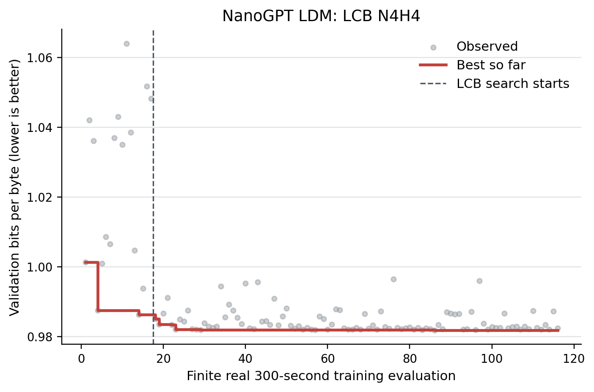

# nanoGPT Task Guide

The nanoGPT task expands a reservoir of candidate training programs through
code edits or structured parameter operations. Mock runs use a tiny
deterministic target. Real runs evaluate candidate training code and optimize
the reported validation BPB.

## Directory Architecture

The task follows the repository-wide layout documented in
[`tasks/README.md`](../README.md):

```text
ldm_task/   shared-runner adapter only
core/       nanoGPT state, generator, surrogate, and model-provider adapters
resources/  seed training programs and operation schemas
scripts/    data preparation, training, and compatibility launchers
tests/      task-local unit and integration tests
runs/       generated run artifacts (Git-ignored)
```

Proposal-search algorithms are shared in `ldm_tts/optimization/search/`, not owned
by this task. NanoGPT supplies the code-state engine and GP-surrogate scoring
adapter used by `single_turn`, best-of-N, tree, beam, and MCTS traversal.

The supported runner entry point is `tasks.nanogpt.ldm_task.procedure:main`.
Import implementation code from `tasks.nanogpt.core`; the legacy launchers in
`scripts/` delegate to the same canonical workflow.

## Quick Start

For a new CPU-only checkout, follow the complete
[clean-room quick start](QUICKSTART.md). The minimal path from the repository
root is:

```bash
CUDA_VISIBLE_DEVICES='' uv sync --locked --project tasks/nanogpt
CUDA_VISIBLE_DEVICES='' uv run --locked --project tasks/nanogpt \
  python scripts/run_ldm_tts.py config/nanogpt/mock_best_of_n.yaml
```

The mock config uses:

- `tasks/nanogpt/resources/train/mock_train.py`
- `tasks/nanogpt/resources/schemas/mock_operations.json`
- output under `tasks/nanogpt/runs/`

## Real Campaign Example

The evaluator-backed LCB N4H4 campaign below uses real 300-second GPU training
evaluations. All 100 requested LCB iterations completed; 99 outer candidates
reached real training, and the best finite `val_bpb` improved from `0.986220`
during warm-up to `0.981844`.



See the [campaign provenance and evidence boundary](../../assets/examples/real_100_20260809/README.md).
The launcher completed with return code 0. Three failed warm-up evaluations and
one invalid outer candidate at iteration 83 were excluded from GP fitting. This
single completed campaign is not a controlled causal estimate of the LDM
component.

## Environment

For real LLM-backed runs, configure an OpenAI-compatible endpoint through the
environment. The committed real configs leave provider fields `null` so
credentials do not enter YAML, process arguments, or dry-run output:

```bash
export LLM_BASE_URL=https://your-model-host.example/v1
export LLM_MODEL_NAME=your-served-model
export LLM_API_KEY=your-api-key
```

The historical `TTS_LLM_URL`, `TTS_LLM_MODEL`, and `TTS_LLM_API_KEY` names are
also accepted. Set the URL to the API root ending in `/v1`, not the full
`/chat/completions` route. The quick start includes an environment-only model
probe.

## Dependency Groups

The default locked environment contains only the mock runner and test
dependencies. Real training is opt-in because it installs a large CUDA Torch
stack:

```bash
uv sync --locked --group train --project tasks/nanogpt
```

Use the default environment for mock runs and `--group train` only for data
preparation or real evaluation on a suitable GPU host.

## Data And Tokenizer

Mock operation-search runs do not need the pretraining dataset. Real training
runs need data and tokenizer artifacts prepared by `prepare.py`.

`prepare.py` downloads text shards from `karpathy/climbmix-400b-shuffle`,
trains a BPE tokenizer with `rustbpe`, and writes metadata used by `train.py`.

Prepare a small local test dataset:

```bash
uv run --locked --group train --project tasks/nanogpt \
  python tasks/nanogpt/scripts/prepare.py --num-shards 8 --download-workers 8
```

Prepare the default number of shards:

```bash
uv run --locked --group train --project tasks/nanogpt \
  python tasks/nanogpt/scripts/prepare.py
```

Use `--num-shards -1` only when you intentionally want the full shard set. The
default cache is `~/.cache/autoresearch`. To use another volume, set the same
environment variable for preparation, dependency checks, and real training:

```bash
export AUTORESEARCH_CACHE_DIR=/path/to/large/local/cache
```

## Dependency Check

Run the preflight from the repository root before a real run:

```bash
uv run --locked --project tasks/nanogpt \
  python scripts/check_task_dependencies.py \
  config/nanogpt/real_operation_tool_best_of_n.yaml
```

The checker validates the target train file, operation schema, LLM settings,
CUDA visibility, and `prepare.py` data/tokenizer artifacts.

## Minimal First Real Run

De-risk a new endpoint and deployment in four stages before starting the full
real configurations below.

1. Verify model discovery and Chat Completions with the environment-only Python
   probe in the [clean-room quick start](QUICKSTART.md#8-optional-real-run-preparation).

2. Check the dependencies needed by a light, evaluation-free plan. Combining
   `args.skip-eval=true` with `--no-optional` intentionally skips the
   `prepare.py` data and tokenizer checks; train/schema and LLM settings are
   still validated.

   ```bash
   uv run --locked --project tasks/nanogpt python scripts/check_task_dependencies.py \
     config/nanogpt/real_operation_tool_best_of_n.yaml \
     --set contract_profile= \
     --set args.iterations=0 \
     --set args.warmup=0 \
     --set args.skip-eval=true \
     --no-optional
   ```

3. Run a zero-iteration contract smoke. This writes the resolved configuration
   and run metadata without executing training:

   ```bash
   uv run --locked --project tasks/nanogpt python scripts/run_ldm_tts.py \
     config/nanogpt/real_operation_tool_best_of_n.yaml \
     --set contract_profile= \
     --set args.iterations=0 \
     --set args.warmup=0 \
     --set args.skip-eval=true \
     --set args.run-name=nanogpt_real_contract_smoke
   ```

4. After preparing the data and tokenizer, run the full dependency check and
   then one evaluated search iteration:

   ```bash
   uv run --locked --project tasks/nanogpt python scripts/check_task_dependencies.py \
     config/nanogpt/real_operation_tool_best_of_n.yaml \
     --set contract_profile= \
     --set args.iterations=1 \
     --set args.warmup=0 \
     --set args.breadth=1 \
     --set args.depth=1

   uv run --locked --project tasks/nanogpt python scripts/run_ldm_tts.py \
     config/nanogpt/real_operation_tool_best_of_n.yaml \
     --set contract_profile= \
     --set args.iterations=1 \
     --set args.warmup=0 \
     --set args.breadth=1 \
     --set args.depth=1 \
     --set args.run-name=nanogpt_real_tiny
   ```

The tiny run performs a real candidate evaluation, so missing data/tokenizer
artifacts remain a blocking failure at that stage.

## Real Runs

Real code-search runs usually target `tasks/nanogpt/resources/train/real_train.py` or
`tasks/nanogpt/scripts/train.py`, use `tasks/nanogpt/resources/schemas/real_operations.json`,
and evaluate candidates with:

```bash
--eval-command "uv run --locked --group train --project {repo_root}/tasks/nanogpt python {train_path}"
```

Starter configs:

```bash
uv run --locked --project tasks/nanogpt \
  python scripts/run_ldm_tts.py config/nanogpt/real_operation_tool_best_of_n.yaml
```

```bash
uv run --locked --project tasks/nanogpt \
  python scripts/run_ldm_tts.py config/nanogpt/real_operation_tool_fixed_best_of_n.yaml
```

Use `real_operation_tool_best_of_n.yaml` for an evolving reservoir expansion
schema. Use `real_operation_tool_fixed_best_of_n.yaml` for a fixed expansion
schema containing every declared operation parameter.

## Customization

Operation schemas live under `tasks/nanogpt/resources/schemas/`. The shared
`tasks.nanogpt.core.expansion_schema` validates operation payloads, computes
surrogate representation dimensions, serializes schemas, and builds active
expansion-schema parameter subsets. For real train-code discovery, keep the
operation schema aligned with top-level assignments in the target `train.py`.

Useful config fields:

| Field | Meaning |
| --- | --- |
| `args.train-file` | Seed training script to edit. |
| `args.operation-schema` | Full reservoir expansion schema. |
| `args.generator` | `operation_mock`, `operation_tool`, or another generator. |
| `args.initial-expansion-parameters` | Initial active expansion-schema parameters. |
| `args.max-expansion-parameters` | Maximum active expansion parameters; `0` means the full schema. |
| `args.disable-expansion-schema-updates` | Keep the initial expansion schema fixed. |
| `args.allow-new-expansion-parameters` | Permit validated parameters not declared in the initial schema. |
| `args.eval-command` | Command used to evaluate a generated candidate. |
| `args.surrogate-mode` | Shared acquisition: `lcb`, `ucb`, `ei`, or `mean`. |
| `args.gp-beta` / `args.gp-xi` | Confidence-bound exploration coefficient / EI margin. |

Use a zero-iteration smoke run to write metadata without training:

```bash
uv run --locked --project tasks/nanogpt \
  python -m tasks.nanogpt.ldm_task.procedure \
  --project-root tasks/nanogpt \
  --train-file resources/train/mock_train.py \
  --operation-schema resources/schemas/mock_operations.json \
  --generator operation_mock \
  --method best_of_n \
  --iterations 0 \
  --warmup 0 \
  --out-dir /tmp/ldm_tts_nanogpt_smoke \
  --run-name nanogpt_contract_smoke \
  --eval-command "python {train_path}" \
  --skip-eval \
  --no-progress
```
