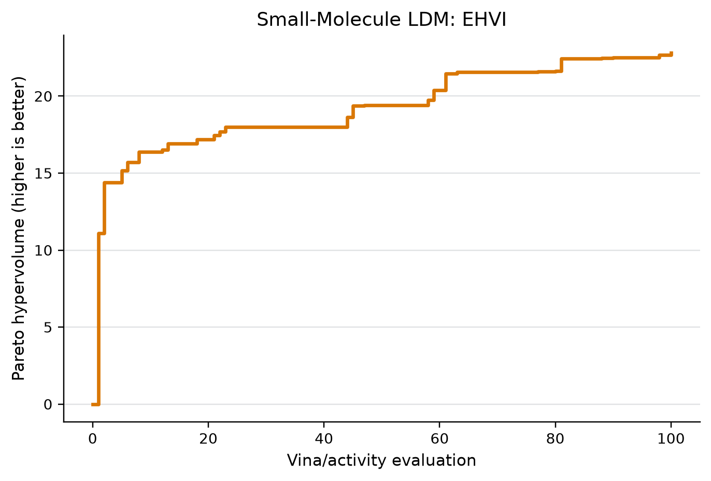

# Small-Molecule Task Guide

The small-molecule task proposes SMILES strings, evaluates docking and activity
objectives, and uses direct LLM ordering or shared BO acquisition to select
candidates. Mock runs use deterministic local scorers. Real runs can use
AutoDock Vina, the G12D activity model, and ReaSyn analog generation.

For a new installation, follow the numbered
[clean-room quick start](QUICKSTART.md) before using this reference guide.

## Directory Architecture

The task follows the repository-wide layout documented in
[`tasks/README.md`](../README.md):

```text
ldm_task/      shared-runner adapter only
core/          molecular search, surrogate, and scorer implementation
resources/     committed model artifacts and other runtime inputs
scripts/       docking extraction and plotting utilities
environments/  optional docking Conda specification
tests/         task-local unit and integration tests
runs/          generated run artifacts (Git-ignored)
```

The task declares the shared `single_turn` proposal topology for each LLM
candidate batch. Its budgeted multi-round loop, molecular acquisition, docking,
and history updates remain in `core/`; `single_turn` does not mean the complete
optimization run has only one round.

The supported runner entry point is
`tasks.small_molecule.ldm_task.procedure:main`. `pyproject.toml` and `uv.lock`
are the authoritative Python environment definition; import implementation
code from `tasks.small_molecule.core`.

## Quick Start

From the repository root:

```bash
uv sync --locked --project tasks/small_molecule
CUDA_VISIBLE_DEVICES='' uv run --locked --project tasks/small_molecule \
  python scripts/run_ldm_tts.py \
  config/small_molecule/mock_m1_stratified_oversample.yaml
```

Mock runs do not need Vina, ReaSyn, the G12D model, or a real LLM endpoint.

## Real Campaign Example

The evaluator-backed example below completed 100 AutoDock Vina plus configured
G12D activity-model evaluations using EHVI selection. Its Pareto hypervolume
reached `22.8080517046179`.



See the [campaign provenance and evidence boundary](../../assets/examples/real_100_20260809/README.md).
The trajectory demonstrates end-to-end optimization progress, not a controlled
causal estimate of the LDM component.

## Environment

For the first CPU-only direct run, configure the LLM endpoint and task-specific
external paths. ReaSyn variables are needed only for analog methods:

```bash
export CUDA_VISIBLE_DEVICES=''
export LLM_BASE_URL=https://your-model-host.example/v1
export LLM_API_KEY=your-api-key
export LLM_MODEL_NAME=your-served-model

export VINA_BIN=/path/to/vina
export G12D=tasks/small_molecule/resources/models/best_g12d_model.joblib
export REASYN_REPO=/path/to/ReaSyn
export REASYN_PYTHON=/path/to/ReaSyn/.venv/bin/python
export REASYN_MODEL_PATH=/path/to/ReaSyn/data/trained_model/ar.ckpt,/path/to/ReaSyn/data/trained_model/eb.ckpt
```

`LLM_BASE_URL` is the OpenAI-compatible API root ending in `/v1`, not the full
`/chat/completions` route. `EMPTY` is suitable only for a local server that does
not validate credentials; authenticated endpoints require their real key.

The real config reads deployment paths and public model settings from the
process environment. The API key remains environment-only so it is not placed
in process arguments or dry-run output:

```yaml
args:
  llm-url: null
  llm-model-name: null
  vina-bin: null
  nn-model-path: resources/models/best_g12d_model.joblib
  reasyn-repo: null
  reasyn-python: null
  reasyn-model-path: null
```

`null` omits the corresponding CLI flag so the task reads its environment
variable at runtime. Use `--set args.<name>=...` when an explicit per-run
override is preferable.

## Dependencies

| Dependency | What It Is | Required For | Configure With |
| --- | --- | --- | --- |
| Python environment | RDKit, Meeko, Gemmi, Gauche/gpytorch, sklearn/LightGBM, OpenAI client, plotting, and data libraries. | Molecule parsing, receptor/ligand prep, GP models, NN scoring, LLM calls. | `uv sync --locked --project tasks/small_molecule`; run with `uv run --locked --project tasks/small_molecule ...`. |
| AutoDock Vina | External docking executable. Produces the Vina objective; lower is better. | Real Vina scoring. | `args.vina-bin`, `env.VINA_BIN`, or `vina` on `PATH`. |
| G12D activity model | Model artifact at `tasks/small_molecule/resources/models/best_g12d_model.joblib`. Produces the activity objective; higher is better. | Real activity scoring. | `args.nn-model-path`, often through `env.G12D`. |
| ReaSyn | External reaction/synthesis-aware analog generator checkout plus AR and Edit Bridge checkpoints. | Seed-analog proposal methods. | `args.reasyn-repo`, `env.REASYN_HOME`, `env.REASYN_REPO`; interpreter through `args.reasyn-python`, `env.REASYN_PYTHON`, or `env.REASYN_BIN`. |
| LLM endpoint | OpenAI-compatible chat endpoint. | Real LLM proposals. | `LLM_BASE_URL`, `LLM_MODEL_NAME`, and environment-only `LLM_API_KEY`; URL/model may also use CLI args. |

## Install AutoDock Vina

Vina is an external executable, not just a Python import. The repository includes
a small Conda environment that installs the executable from `conda-forge`:

```bash
conda env create -f tasks/small_molecule/environments/docking.yaml
export VINA_BIN="$(conda run -n markush-dock which vina | sed '/^[[:space:]]*$/d' | tail -n 1)"
test -x "$VINA_BIN"
"$VINA_BIN" --help
```

If the environment already exists, update it instead:

```bash
conda env update -n markush-dock -f tasks/small_molecule/environments/docking.yaml --prune
```

Alternatively, download the appropriate archive from the
[official AutoDock Vina releases](https://github.com/ccsb-scripps/AutoDock-Vina/releases),
extract it, make the `vina` binary executable, and set its absolute path:

```bash
chmod +x /opt/autodock-vina/bin/vina
export VINA_BIN=/opt/autodock-vina/bin/vina
"$VINA_BIN" --help
```

The preflight requires `vina --help` to exit successfully. A path that merely
exists, points to a directory, lacks execute permission, or exits nonzero is not
accepted.

## Install ReaSyn

ReaSyn is a separate project and its upstream URL and model artifacts are not
vendored in this repository. Obtain the checkout and the two trained checkpoints
from the ReaSyn distribution available to your organization. Do not create empty
placeholder checkpoint files; the preflight rejects them.

Set `REASYN_GIT_URL` to the URL supplied with your ReaSyn distribution. Clone
or unpack ReaSyn, then create an environment inside its checkout:

```bash
test -n "$REASYN_GIT_URL"
export REASYN_REPO=/opt/ReaSyn
git clone "$REASYN_GIT_URL" "$REASYN_REPO"
cd "$REASYN_REPO"
uv venv .venv
```

Install using the dependency manifest shipped by that ReaSyn revision. Common
layouts use one of these commands:

```bash
# ReaSyn revisions with pyproject.toml / uv.lock
uv sync

# ReaSyn revisions with requirements.txt
uv pip install --python .venv/bin/python -r requirements.txt
```

Configure the interpreter and verify the checkout layout:

```bash
export REASYN_PYTHON="$REASYN_REPO/.venv/bin/python"
test -x "$REASYN_PYTHON"
test -f "$REASYN_REPO/reasyn/sampler/parallel.py"

"$REASYN_PYTHON" -c \
  'import sys; sys.path.insert(0, sys.argv[1]); from reasyn.chem.mol import Molecule; import reasyn.sampler.parallel; print(Molecule("CCO"))' \
  "$REASYN_REPO"
```

Put the AR and Edit Bridge checkpoints at ReaSyn's default paths:

```text
data/trained_model/nv-reasyn-ar-166m-v2.ckpt
data/trained_model/nv-reasyn-eb-174m-v2.ckpt
```

Then configure their absolute paths explicitly:

```bash
export REASYN_MODEL_PATH="$REASYN_REPO/data/trained_model/nv-reasyn-ar-166m-v2.ckpt,$REASYN_REPO/data/trained_model/nv-reasyn-eb-174m-v2.ckpt"
test -s "$REASYN_REPO/data/trained_model/nv-reasyn-ar-166m-v2.ckpt"
test -s "$REASYN_REPO/data/trained_model/nv-reasyn-eb-174m-v2.ckpt"
```

ReaSyn analog generation requires CUDA. Set the physical GPUs available to the
process and use `args.reasyn-devices` for the corresponding device IDs:

```bash
export CUDA_VISIBLE_DEVICES=0
nvidia-smi
```

## Required Dependency Check

Run the preflight from the small-molecule environment before every real
experiment. The example real config reads deployment-specific paths from the
environment; `--set` provides an explicit per-run alternative:

```bash
uv run --locked --project tasks/small_molecule python scripts/check_task_dependencies.py \
  config/small_molecule/real_m1_seed_analog.yaml \
  --set args.vina-bin="$VINA_BIN" \
  --set args.nn-model-path="$G12D" \
  --set args.reasyn-repo="$REASYN_REPO" \
  --set args.reasyn-python="$REASYN_PYTHON" \
  --set args.reasyn-model-path="$REASYN_MODEL_PATH"
```

If a direct-only method will not call ReaSyn but your config still contains
ReaSyn path placeholders, skip optional checks:

```bash
uv run --locked --project tasks/small_molecule python scripts/check_task_dependencies.py \
  config/small_molecule/real_m1_seed_analog.yaml \
  --set args.vina-bin="$VINA_BIN" \
  --set args.nn-model-path="$G12D" \
  --no-optional
```

The checker validates:

- LLM URL, model name, and API key setup
- requested CUDA visibility
- AutoDock Vina executable and `--help` response
- G12D activity model artifact
- ReaSyn checkout, executable interpreter, real import probe, non-empty
  checkpoints, and CUDA devices when configured

The small-molecule real workflow also performs an early runtime preflight for
Vina and the activity model before starting the search. The standalone checker
is still required for ReaSyn methods because it validates the separate ReaSyn
environment before an expensive run starts. It does not perform docking or
generate analogs.

## Vina

Check Vina manually:

```bash
$VINA_BIN --help
```

Vina caches receptor preparation and docking results under
`<trajectory-dir>/vina_cache` by default. To reuse an old cache, set
`args.vina-cache-dir` to that directory. If a round has candidates but no
selection, inspect `selection_results.failed_evaluations` in `rounds.jsonl`.

Acquisition selection is configured with `args.acq`: use `ehvi` for expected
hypervolume improvement or `mean` for a weighted posterior mean. For `mean`,
set `args.acq-weights` to a comma-separated Vina/activity pair such as
`0.5,0.5`. Both modes use the task-independent implementation in
`ldm_tts.acquisition`.

Important Vina fields:

| Field | Meaning |
| --- | --- |
| `args.vina-bin` | Vina executable path. |
| `args.vina-pdb-id` | Receptor PDB id; default is `8UN5`. |
| `args.vina-chain-id` | Receptor chain id. |
| `args.vina-cache-dir` | Optional existing docking cache to reuse. |
| `args.vina-exhaustiveness` | Vina exhaustiveness. |
| `args.vina-n-poses` | Number of poses requested. |

## ReaSyn Configuration Reference

ReaSyn must expose `reasyn/sampler/parallel.py` under the checkout. The
selected interpreter must be able to import ReaSyn and its chemistry
dependencies:

```bash
$REASYN_PYTHON -c "import sys, os; sys.path.insert(0, os.environ['REASYN_REPO']); from reasyn.chem.mol import Molecule; print(Molecule('CCO').is_valid)"
```

Default ReaSyn checkpoints, relative to the ReaSyn checkout:

```text
data/trained_model/nv-reasyn-ar-166m-v2.ckpt
data/trained_model/nv-reasyn-eb-174m-v2.ckpt
```

Override them with `args.reasyn-model-path` as a comma-separated pair. Use
`args.reasyn-devices` for CUDA device IDs and `args.reasyn-time-limit` to bound
each ReaSyn call.

Interpreter resolution order:

1. `args.reasyn-python`
2. `env.REASYN_PYTHON`
3. `env.REASYN_BIN`
4. `<REASYN_REPO>/.venv/bin/python`
5. the current task interpreter; use `uv run --locked --project tasks/small_molecule` when
   relying on this fallback

If ReaSyn raises an import error such as `No module named 'omegaconf'`, install
or sync that dependency in the interpreter selected by the list above.

## Minimal First Real Run

De-risk a new small-molecule deployment in four stages before starting the
full real configuration below.

1. Verify that the configured model is reachable and accepts Chat Completions.
   Use the environment-only probe in the
   [clean-room quick start](QUICKSTART.md#6-probe-the-model-api).

2. Check the dependencies for the direct-LLM path. `--no-optional` skips the
   ReaSyn checkout, interpreter, checkpoint, and CUDA checks, but still checks
   the LLM settings, GP device, Vina executable, and G12D model:

   ```bash
   CUDA_VISIBLE_DEVICES='' uv run --locked --project tasks/small_molecule \
     python scripts/check_task_dependencies.py \
     config/small_molecule/real_m1_seed_analog.yaml \
     --set args.vina-bin="$VINA_BIN" \
     --set args.nn-model-path="$G12D" \
     --no-optional
   ```

3. Run the real adapter's contract dry-run. This resolves the task
   configuration and emits the shared LDM task specification without calling
   the LLM, Vina, the activity model, or ReaSyn:

   ```bash
   CUDA_VISIBLE_DEVICES='' uv run --locked --project tasks/small_molecule \
     python scripts/run_ldm_tts.py \
     config/small_molecule/real_m1_seed_analog.yaml \
     --set args.dry-run=true \
     --set args.budget=1 \
     --set args.init-size=1 \
     --set args.trajectory-dir=runs/first_real_contract
   ```

4. Run one real direct-LLM proposal and one evaluated molecule. This exercises
   the served model, Vina, and G12D scorer, while keeping ReaSyn out of the
   selected method:

   ```bash
   CUDA_VISIBLE_DEVICES='' uv run --locked --project tasks/small_molecule \
     python scripts/run_ldm_tts.py \
     config/small_molecule/real_m1_seed_analog.yaml \
     --set args.budget=1 \
     --set args.init-size=1 \
     --set args.batch-size=1 \
     --set args.m1-k-direct-llm=4 \
     --set args.max-candidates-per-round=4 \
     --set args.max-empty-reservoir-rounds=2 \
     --set args.allow-early-stop=true \
     --set args.vina-bin="$VINA_BIN" \
     --set args.nn-model-path="$G12D" \
     --set args.vina-exhaustiveness=1 \
     --set args.vina-n-poses=1 \
     --set args.trajectory-dir=runs/first_real_tiny
   ```

Use the full dependency check without `--no-optional` before switching to an
analog/ReaSyn method. The tiny direct run still performs real docking and model
inference; it is intentionally small, not a mock.

## Real Runs

Starter config:

```bash
uv run --locked --project tasks/small_molecule \
  python scripts/run_ldm_tts.py config/small_molecule/real_m1_seed_analog.yaml
```

Use `--dry-run` before changing deployment paths:

```bash
python scripts/run_ldm_tts.py config/small_molecule/real_m1_seed_analog.yaml --dry-run
```

## Plotting

Plot a completed run:

```bash
uv run --locked --project tasks/small_molecule \
  python tasks/small_molecule/scripts/plot_pareto_hv.py \
  tasks/small_molecule/runs/case2_mock_m1
```

The plotter writes `pareto_hv.png`, `pareto_hv.pdf`,
`pareto_hv_hypervolume.csv`, and `pareto_hv_summary.csv` under the run's
`plots/` directory.
